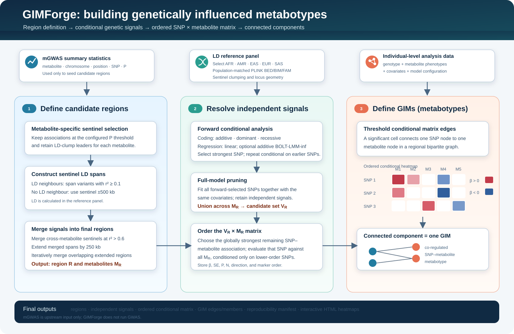
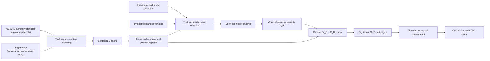

# GIMForge

GIMForge constructs **GIMs (Genetically Influenced Metabotypes)** from
precomputed mGWAS summary statistics, a population-matched LD reference panel,
and individual-level genotype and metabolite data.

GIMForge does **not** run the upstream mGWAS. It uses existing mGWAS results to
define candidate regions, runs individual-level conditional analyses, and
writes GIM membership tables plus an offline interactive HTML report.



<p>
  <a href="#42-quick-run-example"><kbd><strong>Already familiar with the settings? Skip to the quick run example →</strong></kbd></a>
</p>

## What you need

GIMForge runs on Linux with Python 3.10+ and
[PLINK2](https://www.cog-genomics.org/plink/2.0/).

| Input | CLI argument | Required format |
| --- | --- | --- |
| mGWAS results | `--sumstats-manifest`, `--sumstats`, or `--sentinels` | Headered TSV/CSV, optionally gzip-compressed |
| LD source | `--ld-bfile` or `--use-analysis-genotype-for-ld` | External PLINK 1 BED/BIM/FAM prefix, or explicitly reuse `--bfile` |
| Study genotype | `--bfile` | PLINK 1 BED/BIM/FAM prefix |
| Metabolite phenotypes | `--phenotypes` | Uncompressed, headered TSV |
| Covariates | `--covariates` | Uncompressed, headered TSV |

The summary statistics, LD panel, and study genotype must use the same genome
build and compatible variant IDs. Summary-statistic trait IDs must exactly
match phenotype column names.

### Important: filter imputation INFO upstream

GIMForge receives precomputed mGWAS results and PLINK BED hard calls, so it
does not perform INFO filtering. Apply INFO QC before running the upstream
mGWAS and again when preparing the imputed genotype source that will be
converted to BED. An INFO column may remain in the summary statistics for
provenance, but GIMForge ignores it.

Recommended thresholds:

- use `INFO > 0.3` as the minimum threshold matching the reference
  conditional-analysis code;
- use `INFO >= 0.8` when a more conservative high-confidence imputation set is
  preferred;
- record the chosen threshold and filter each cohort before merging data.

The stricter threshold improves imputation confidence but can remove more
low-frequency and rare variants. Choose it according to the imputation panel,
sample size, and analysis plan.

MAF, MAC, HWE, and genotype missingness remain configurable inside GIMForge.
A paper-oriented starting point is:

```bash
--maf-min 0.0001 \
--mac-min 11 \
--hwe-p-min 1e-6 \
--geno-missing-max 0.05
```

Here `--mac-min 11` implements the paper's strict `MAC > 10` rule. These
settings are recommendations, not defaults, so existing runs do not change
silently. They are applied to both the LD genotype and study genotype. Do not
blindly use `--mac-min 11` with a small reference panel when rare variants
matter; use a sufficiently large matched panel or
`--use-analysis-genotype-for-ld`.

GIMForge also reports the reference study's three MAF categories:
`rare` (MAF ≤1%), `low_frequency` (1% < MAF ≤5%), and `common` (MAF >5%).
This is descriptive output from the conditional-analysis genotype, not a
separate association model or WES validation step.

## 1. Install

Clone the repository and install it in a virtual environment:

```bash
git clone https://github.com/zl2860/GIMForge.git
cd GIMForge

python3 -m venv .venv
source .venv/bin/activate
python -m pip install --upgrade pip
python -m pip install .
```

Install [PLINK2](https://www.cog-genomics.org/plink/2.0/) and place `plink2`
in `PATH`, then verify the environment:

```bash
gimforge doctor
```

If PLINK2 is installed elsewhere:

```bash
gimforge doctor --plink2 /absolute/path/to/plink2
```

BOLT-LMM is optional and is required only for
`--regression-model mixed`. Developer installation, dependency checks, and
mixed-model setup are covered in [Detailed installation](#6-detailed-installation).

## 2. Prepare the inputs

A typical project layout is:

```text
project/
├── data/
│   ├── mgwas_files.tsv
│   ├── sumstats/
│   ├── cohort.bed
│   ├── cohort.bim
│   ├── cohort.fam
│   ├── phenotypes.tsv
│   └── covariates.tsv
├── reference/
│   ├── 1000G_phase3_EAS.bed
│   ├── 1000G_phase3_EAS.bim
│   └── 1000G_phase3_EAS.fam
└── results/
```

### 2.1 mGWAS summary statistics

The recommended layout is one GWAS file per trait plus a two-column manifest:

```text
trait_id	path
M001	sumstats/M001.tsv.gz
M002	sumstats/M002.tsv.gz
M003	sumstats/M003.tsv.gz
```

Paths may be absolute or relative to the manifest. Each `trait_id` must be
unique and must exactly equal a column name in `phenotypes.tsv`.

Each referenced GWAS file needs four fields:

```text
#CHROM	POS	ID	P
1	154453788	rs11209026	2.1e-14
6	32658541	rs9273363	4.7e-12
```

The default names and accepted aliases are:

| Field | Default | Accepted aliases |
| --- | --- | --- |
| Chromosome | `chromosome` | `CHROM`, `#CHROM`, `chr` |
| Position | `position` | `POS`, `BP`, `pos` |
| Variant ID | `snp_id` | `ID`, `SNP`, `rsid`, `MarkerName` |
| P value | `p` | `P`, `p_value`, `Pvalue` |

Alternatively, `--sumstats` accepts one stacked long-format table with an
additional `metabolite` column:

```text
metabolite	chromosome	position	snp_id	p
M001	1	154453788	rs11209026	2.1e-14
M002	1	154453788	rs11209026	8.4e-13
```

Files ending in `.csv` or `.csv.gz` are comma-separated. All other
summary-statistic files are read as tab-separated. Extra columns are allowed.
See [Detailed input reference](#7-detailed-input-reference) for custom column
names and the precomputed `--sentinels` format.

### 2.2 LD source

Choose one of the following routes.

#### Route A: download an LDSC-style ready-made panel

For GRCh37 data, the quickest route is the chromosome-split 1000 Genomes
Phase 3 PLINK panel archived with the S-LDSC resources:

| Ancestry | Ready-made genotype archive | Size | MD5 |
| --- | --- | ---: | --- |
| East Asian (EAS) | [`1000G_Phase3_EAS_plinkfiles.tgz`](https://zenodo.org/records/10515792/files/1000G_Phase3_EAS_plinkfiles.tgz?download=1) | 322.8 MB | `abf52fba6416622ea0757ca9aca51a87` |
| European (EUR) | [`1000G_Phase3_plinkfiles.tgz`](https://zenodo.org/records/10515792/files/1000G_Phase3_plinkfiles.tgz?download=1) | 288.3 MB | `a7773ab485827b533cb300c76356d76b` |

These archives contain the `.bed/.bim/.fam` genotype files GIMForge needs.
The LDSC files ending in `.l2.ldscore.gz` are precomputed LD scores, not
genotypes, and cannot be passed to `--ld-bfile`.

Download and merge the EAS chromosomes into one PLINK prefix:

```bash
mkdir -p reference

wget -O reference/1000G_Phase3_EAS_plinkfiles.tgz \
  "https://zenodo.org/records/10515792/files/1000G_Phase3_EAS_plinkfiles.tgz?download=1"

printf '%s  %s\n' \
  "abf52fba6416622ea0757ca9aca51a87" \
  "reference/1000G_Phase3_EAS_plinkfiles.tgz" |
  md5sum --check -

tar -xzf reference/1000G_Phase3_EAS_plinkfiles.tgz -C reference

: > reference/eas_bfiles.txt
for chr in $(seq 1 22); do
  printf '%s\n' \
    "reference/1000G_Phase3_EAS_plinkfiles/1000G.EAS.QC.${chr}" \
    >> reference/eas_bfiles.txt
done

plink2 \
  --pmerge-list reference/eas_bfiles.txt bfile \
  --make-bed \
  --out reference/1000G.EAS.QC
```

Then use:

```bash
--ancestry EAS \
--ld-bfile reference/1000G.EAS.QC \
--ld-panel-name "1000 Genomes Phase 3 EAS, S-LDSC archive (GRCh37)"
```

For EUR, download the EUR archive and replace the directory/prefix with
`1000G_Phase3_plinkfiles/1000G.EUR.QC.`. The full Zenodo record and
provenance are at [1000 Genomes Project LD reference data](https://zenodo.org/records/10515792).

#### Route B: prepare another ancestry or genome build

Use the official
[PLINK2 1000 Genomes resources](https://www.cog-genomics.org/plink/2.0/resources#phase3_1kg)
when you need AFR, AMR, SAS, GRCh38, or a denser panel. The complete download
and conversion commands are in
[LD reference choices and preparation](#8-ld-reference-choices-and-preparation).

#### Route C: calculate LD from the existing study genotype

If the analysis genotype is sufficiently dense and represents the same
ancestry as the mGWAS, GIMForge can reuse it explicitly:

```bash
--bfile data/cohort \
--use-analysis-genotype-for-ld \
--ancestry EAS \
--ld-panel-name "Study cohort EAS genotype reused for LD"
```

GIMForge calculates the required clumping and regional LD values on demand;
you do not need to precompute an LD matrix. Prefer a separate ancestry-matched
reference panel when the cohort is small, admixed, strongly related, or
otherwise not representative of the mGWAS population.

Whichever route is used, do not mix GRCh37 and GRCh38, and ensure the PLINK
BIM variant IDs match the mGWAS variant IDs.

### 2.3 Study genotype

`--bfile data/cohort` requires:

```text
data/cohort.bed
data/cohort.bim
data/cohort.fam
```

This dataset contains the study participants used in the conditional models.
Its FAM `FID` and `IID` values must match the phenotype and covariate files.
Its genome build and variant IDs must be compatible with the mGWAS and LD
panel.

When this same dataset is also a suitable LD source, select
`--use-analysis-genotype-for-ld` instead of repeating the path with
`--ld-bfile`.

For imputed data, apply the selected INFO threshold before BED creation.
GIMForge can then apply `--maf-min`, `--mac-min`, `--hwe-p-min`, and
`--geno-missing-max` to the BED data.

### 2.4 Metabolite phenotypes

`--phenotypes` must be an uncompressed, headered, tab-separated file. The first
two columns are `FID` and `IID`; every remaining column is a numeric
quantitative trait:

```text
FID	IID	M001	M002	M003
F001	S001	0.381	-0.227	1.104
F001	S002	-0.514	0.093	0.672
F002	S003	1.238	-0.841	-0.126
```

Each `FID`/`IID` pair must be unique. Missing phenotypes may be encoded as
`NA`, `nan`, or `-9`. CSV and gzip-compressed phenotype files are rejected.

### 2.5 Covariates

`--covariates` follows the same TSV layout. All columns after `FID` and `IID`
must be numeric:

```text
FID	IID	age	sex	PC1	PC2	batch_2
F001	S001	54	0	-0.012	0.004	0
F001	S002	61	1	0.007	-0.015	1
F002	S003	48	0	0.021	0.011	0
```

Encode categorical variables as numeric indicator columns before running.
Individuals with any missing covariate are excluded.

## 3. Check the data before running

Confirm that:

1. The mGWAS, LD panel, and study genotype use one genome build.
2. mGWAS variant IDs exist in the LD-panel BIM.
3. Regional variants also exist in the study BIM.
4. Every mGWAS trait ID exactly matches a phenotype column.
5. Phenotype and covariate `FID`/`IID` values match the study FAM.
6. INFO filtering was completed before imputed genotypes were converted to
   BED.
7. The output directory is new or empty.

## 4. Run GIMForge

### 4.1 GIM definition in pseudocode

```text
INPUT
  mGWAS summary statistics
  LD genotype (the study genotype in the examples below, or an external panel)
  individual-level study genotype, metabolite phenotypes, and covariates

1. DEFINE CANDIDATE REGIONS
   for each metabolite:
       keep associations with 0 < P <= sentinel_p
       LD-clump them within that metabolite to obtain sentinels

   for each sentinel:
       construct its LD span from variants with r² >= ld_span_r2

   link cross-metabolite sentinel signals when they share a sentinel or
   have r² > cross_metabolite_merge_r2
   add region padding and merge overlapping spans

2. FIND TRAIT-SPECIFIC INDEPENDENT SIGNALS
   for each region R:
       M_R = metabolites assigned to R
       V_R = empty set

       for each metabolite m in M_R:
           selected = []
           repeat:
               test every eligible regional variant for m,
               conditioning on selected
               best = variant with the smallest conditional P
               stop if no valid best exists or best.P > conditional_p
               add best to selected

           jointly retest each selected variant while conditioning on
           all other selected variants
           add retained variants to V_R
           if the optional single-forward-lead fallback applies:
               add that lead to V_R

3. BUILD THE ORDERED SNP × METABOLITE MATRIX
   ordered = []
   remaining = V_R

   while remaining is not empty:
       test every (variant in remaining) × (metabolite in M_R),
       conditioning on ordered variants
       best_cell = tested pair with the smallest conditional P
       stop if no valid cell exists or best_cell.P > conditional_p
       add best_cell.variant to ordered
       store that variant's conditional result for every metabolite in M_R
       remove that variant from remaining

4. DEFINE GIMs
   retain matrix cells with P <= conditional_p as SNP–metabolite edges
   construct a bipartite graph from those edges
   each connected component within a region is one GIM

OUTPUT
  GIM membership, conditional association matrix, MAF classes, and HTML report
```

The complete statistical and region-merging details are in
[Method](#12-method).

### 4.2 Quick run example

Start with one region as a smoke test:

```bash
gimforge run \
  --sumstats-manifest data/mgwas_files.tsv \
  --bfile data/cohort \
  --use-analysis-genotype-for-ld \
  --ancestry EAS \
  --ld-panel-name "Study cohort EAS genotype reused for LD" \
  --phenotypes data/phenotypes.tsv \
  --covariates data/covariates.tsv \
  --maf-min 0.0001 \
  --mac-min 11 \
  --hwe-p-min 1e-6 \
  --geno-missing-max 0.05 \
  --threads 8 \
  --max-regions 1 \
  --out results/smoke-test
```

To use an existing external LD reference panel instead, remove
`--use-analysis-genotype-for-ld` and replace the study-cohort panel label
with:

```bash
--ld-bfile reference/1000G_phase3_EAS \
--ld-panel-name "1000 Genomes Phase 3 EAS (GRCh37)"
```

Keep `--bfile data/cohort`: it is still the individual-level genotype used
for conditional analysis.

If PLINK2 is not in `PATH`, add:

```bash
--plink2 /absolute/path/to/plink2
```

For the full run, remove `--max-regions 1` and use a new output directory:

```bash
gimforge run \
  --sumstats-manifest data/mgwas_files.tsv \
  --bfile data/cohort \
  --use-analysis-genotype-for-ld \
  --ancestry EAS \
  --ld-panel-name "Study cohort EAS genotype reused for LD" \
  --phenotypes data/phenotypes.tsv \
  --covariates data/covariates.tsv \
  --maf-min 0.0001 \
  --mac-min 11 \
  --hwe-p-min 1e-6 \
  --geno-missing-max 0.05 \
  --threads 8 \
  --out results/gimforge
```

For an existing external LD panel, make the same substitution shown directly
below the smoke-test command; do not supply `--ld-bfile` and
`--use-analysis-genotype-for-ld` together.

To review trait-specific clumping before the conditional analysis, run
`gimforge clump` first and resume with `--sentinels`. See
[Detailed running workflows](#9-detailed-running-workflows).

## 5. Key outputs

| File | What to open or inspect |
| --- | --- |
| `report.html` | Offline interactive GIM browser and conditional heatmap |
| `gim_summary.tsv` | One row per GIM with membership and SNP MAF-class counts |
| `matrix_out.tsv.gz` | Complete ordered conditional SNP-by-metabolite matrix |
| `regions.tsv` | Final candidate-region boundaries |
| `run_manifest.json` | Input paths, software versions, LD panel, and parameters |
| `run.log` | Timestamped progress and errors |

Open the report on Linux:

```bash
xdg-open results/gimforge/report.html
```

The complete schema and interpretation notes are in
[Outputs and report](#11-outputs-and-report).

## Detailed guide

- [6. Detailed installation](#6-detailed-installation)
- [7. Detailed input reference](#7-detailed-input-reference)
- [8. LD reference choices and preparation](#8-ld-reference-choices-and-preparation)
- [9. Detailed running workflows](#9-detailed-running-workflows)
- [10. Parameters and models](#10-parameters-and-models)
- [11. Outputs and report](#11-outputs-and-report)
- [12. Method](#12-method)
- [13. Troubleshooting](#13-troubleshooting)
- [14. Citation and license](#14-citation-and-license)

## 6. Detailed installation

### 6.1 Requirements

The supported environment is Linux with:

- Python 3.10 or newer;
- [PLINK2](https://www.cog-genomics.org/plink/2.0/);
- enough local storage for genotype inputs and temporary regional results.

GIMForge itself has no third-party Python runtime dependencies. BOLT-LMM is
optional and is needed only for additive mixed-model conditional analysis.

### 6.2 Standard installation

```bash
git clone https://github.com/zl2860/GIMForge.git
cd GIMForge

python3 -m venv .venv
source .venv/bin/activate
python -m pip install --upgrade pip
python -m pip install .
```

The `gimforge` command is available whenever this virtual environment is
active. For development, install the checkout in editable mode:

```bash
python -m pip install -e .
```

### 6.3 PLINK2

Download the current Linux build from the official
[PLINK2 download page](https://www.cog-genomics.org/plink/2.0/), unpack it,
and make the executable available in `PATH`.

For example, if PLINK2 is under `/opt/plink2`:

```bash
chmod +x /opt/plink2/plink2
export PATH="/opt/plink2:$PATH"
```

Alternatively, keep it outside `PATH` and supply the full path:

```bash
gimforge doctor --plink2 /opt/plink2/plink2
gimforge run ... --plink2 /opt/plink2/plink2
```

### 6.4 Check the installation

```bash
gimforge doctor
```

A linear-model environment should report:

```text
Python	ok	...
PLINK2	ok	...
BOLT-LMM	optional	required only with --regression-model mixed
Python packages	ok	none required outside the standard library
```

`gimforge doctor` returns exit code `0` when all dependencies required by the
selected model are available and exit code `2` otherwise.

### 6.5 Optional BOLT-LMM setup

[BOLT-LMM](https://alkesgroup.broadinstitute.org/BOLT-LMM/) is required only
with:

```bash
--regression-model mixed --genetic-model additive
```

Check the mixed-model environment after installing `bolt`:

```bash
gimforge doctor \
  --regression-model mixed \
  --plink2 /opt/plink2/plink2 \
  --bolt /opt/BOLT-LMM/bolt
```

A mixed-model run also requires:

- `--bolt-model-bfile`: a genome-wide PLINK BED/BIM/FAM dataset containing
  every retained analysis sample; it defaults to `--bfile`;
- `--bolt-genetic-map`: a BOLT-LMM genetic map matching the genotype build.

BOLT-LMM supports additive tests only. GIMForge rejects mixed-model dominant
or recessive combinations instead of silently changing the genetic model.

### 6.6 Test and update a checkout

Run the test suite:

```bash
PYTHONPATH=src python -m unittest discover -s tests -v
```

Update an existing installation:

```bash
git pull --ff-only
source .venv/bin/activate
python -m pip install --upgrade .
gimforge doctor
```

Run a one-region smoke test after updating and before starting a large
analysis.

## 7. Detailed input reference

A complete run needs five logical inputs:

| Input | Argument | Format |
| --- | --- | --- |
| Region-seed associations | `--sumstats-manifest`, `--sumstats`, or `--sentinels` | Headered table |
| LD source | `--ld-bfile` or `--use-analysis-genotype-for-ld` | External PLINK prefix, or the study genotype |
| Study genotype | `--bfile` | PLINK 1 BED/BIM/FAM prefix |
| Quantitative traits | `--phenotypes` | Uncompressed headered TSV |
| Model covariates | `--covariates` | Uncompressed headered TSV |

### 7.1 Summary-statistic mode A: one file per trait

This is recommended when mGWAS results already exist as separate files.
Create a tab-separated manifest:

```text
trait_id	path
M001	sumstats/M001.tsv.gz
M002	sumstats/M002.tsv.gz
M003	sumstats/M003.tsv.gz
```

Requirements:

- columns are named `trait_id` and `path`;
- every `trait_id` is nonempty and unique;
- each `trait_id` exactly equals one phenotype column name;
- relative paths are resolved from the manifest directory;
- each referenced file contains one trait.

Each per-trait file needs chromosome, position, variant ID, and P value:

```text
#CHROM	POS	ID	P
1	154453788	rs11209026	2.1e-14
6	32658541	rs9273363	4.7e-12
```

Invoke it with:

```bash
--sumstats-manifest data/mgwas_files.tsv
```

GIMForge reads the files one at a time and retains only associations passing
`--sentinel-p`.

### 7.2 Summary-statistic mode B: one stacked table

Use a long-format table when all traits are concatenated row-wise:

```text
metabolite	chromosome	position	snp_id	p
M001	1	154453788	rs11209026	2.1e-14
M002	1	154453788	rs11209026	8.4e-13
M001	6	32658541	rs9273363	4.7e-12
```

Invoke it with:

```bash
--sumstats data/all_metabolites.tsv.gz
```

The `metabolite` value must exactly match a phenotype column. Clumping is
still performed separately for every trait, never as one global multi-trait
clump.

### 7.3 Summary-statistic fields and aliases

| Logical field | Default name | Automatic aliases | Content |
| --- | --- | --- | --- |
| Trait | `metabolite` | `Metabolite`, `trait`, `phenotype` | Stable trait ID |
| Chromosome | `chromosome` | `CHROM`, `#CHROM`, `chr` | `1`-`22` or lowercase `chr1`-`chr22` |
| Position | `position` | `POS`, `BP`, `pos` | Integer base-pair coordinate |
| Variant ID | `snp_id` | `ID`, `SNP`, `rsid`, `MarkerName` | ID matching the genotype BIM |
| P value | `p` | `P`, `p_value`, `Pvalue` | Numeric value in `(0, 1]` |

Declare nonstandard names explicitly:

```bash
--sumstats-metabolite-column trait_id \
--sumstats-chromosome-column CHR \
--sumstats-position-column BP \
--sumstats-snp-column RSID \
--sumstats-p-column PVALUE
```

The metabolite-column option is ignored for per-trait files in a manifest,
because the manifest supplies the trait ID.

Files ending in `.csv` or `.csv.gz` are comma-separated. All other
summary-statistic filenames, including `.tsv`, `.tsv.gz`, and `.txt`, are
tab-separated.

Extra allele, beta, standard-error, frequency, and sample-size columns are
allowed and ignored during region construction. Summary statistics are used
only for trait ID, coordinate, variant ID, and P value; effect-allele
harmonisation is not performed at this stage.

### 7.4 Summary-statistic mode C: reviewed sentinels

`gimforge clump` writes:

```text
metabolite	chromosome	position	snp_id	p
M001	1	154453788	rs11209026	2.1e-14
M002	1	154453788	rs11209026	8.4e-13
M003	6	32658541	rs9273363	4.7e-12
```

This contains only retained trait-specific clump leaders. Resume with:

```bash
--sentinels results/clumping/sentinels.tsv
```

Every supplied row is kept. GIMForge skips sentinel filtering and clumping,
then uses the selected LD source to calculate LD spans and merge cross-trait
regions. Keep `sentinels.tsv` together with its clumping
`run_manifest.json`.

### 7.5 LD genotype

An external LD source is a PLINK 1 binary prefix:

```text
reference/1000G.EAS.QC.bed
reference/1000G.EAS.QC.bim
reference/1000G.EAS.QC.fam
```

Pass the prefix without an extension:

```bash
--ld-bfile reference/1000G.EAS.QC
```

Alternatively, explicitly reuse the study genotype:

```bash
--bfile data/cohort --use-analysis-genotype-for-ld
```

In either case, the LD genotype should:

- match the mGWAS ancestry;
- use the same genome build as the summary statistics and study genotype;
- have BIM IDs matching summary-statistic variant IDs;
- contain autosomal, biallelic A/C/G/T variants with unique IDs;
- have enough regional density around candidate sentinels.

Reference-panel sample IDs do not need to overlap study sample IDs.

### 7.6 Study genotype

`--bfile` is a PLINK 1 binary prefix:

```text
data/cohort.bed
data/cohort.bim
data/cohort.fam
```

This dataset supplies the individual-level genotypes for every conditional
regression. GIMForge accepts hard-call BED input, filters to autosomal
biallelic A/C/G/T SNPs, applies `--mac-min`, and optionally applies
`--maf-min`, `--hwe-p-min`, and `--geno-missing-max`.

FAM `FID` and `IID` values must match the individual-level tables. The
phenotype value in FAM column 6 is ignored.

### 7.7 Phenotype table

The phenotype file must be uncompressed, headered, tab-separated, and contain
one row per unique `FID`/`IID` pair:

```text
FID	IID	M001	M002	M003
F001	S001	0.381	-0.227	1.104
F001	S002	-0.514	0.093	0.672
F002	S003	1.238	-0.841	-0.126
```

The first two columns must be `FID` and `IID`; every remaining column is a
numeric trait. Missing values may be an empty field, `NA`, `nan`, or `-9`.
PLINK2 determines the usable sample set separately for each trait.

CSV and gzip-compressed phenotype files are rejected because the original
file is passed directly to PLINK2. Trait normalisation, batch correction,
transformation, and other preprocessing must be completed before GIMForge.

### 7.8 Covariate table

Covariates use the same uncompressed TSV structure:

```text
FID	IID	age	sex	PC1	PC2	PC3	batch_2
F001	S001	54	0	-0.012	0.004	0.018	0
F001	S002	61	1	0.007	-0.015	0.003	1
F002	S003	48	0	0.021	0.011	-0.009	0
```

Requirements:

- first two columns are `FID` and `IID`;
- at least one covariate column is present;
- all covariates are numeric;
- categorical variables are pre-encoded as numeric indicator columns;
- each `FID`/`IID` pair is unique.

An individual with an empty value, `NA`, `NaN`, or `-9` in any covariate is
excluded from all models. GIMForge variance-standardises the supplied
covariates for numerical stability.

### 7.9 Cross-file consistency

Before running:

1. Confirm one genome build across mGWAS, LD genotype, and study genotype.
2. Confirm summary-statistic IDs exist in the LD BIM.
3. Confirm candidate-region variants exist in the study BIM.
4. Confirm every mGWAS trait ID exactly equals a phenotype column.
5. Confirm phenotype and covariate IDs overlap the study FAM.
6. Confirm phenotype and covariate values are numeric or recognised missing
   codes.
7. Confirm INFO filtering was completed before imputed data were converted to
   BED.
8. Record the true LD genotype ancestry with `--ancestry`; GIMForge does not
   infer it from a filename.

## 8. LD reference choices and preparation

GIMForge uses LD genotypes for:

1. trait-specific sentinel clumping;
2. sentinel LD-span construction;
3. cross-trait signal merging.

The individual-level conditional regressions always use `--bfile`, regardless
of which LD route is selected.

### 8.1 Choose the correct route

| Situation | Recommended route |
| --- | --- |
| EAS or EUR, GRCh37, rsID-compatible mGWAS | Download the ready-made S-LDSC/1000G PLINK archive |
| AFR, AMR, SAS, or a narrower 1000G population | Download the full PLINK2 resource and extract samples |
| GRCh38 | Download the high-coverage PLINK2 1000G resource |
| Dense, representative study genotype already available | Use `--use-analysis-genotype-for-ld` |
| A suitable subset exists within the study cohort | Build a separate LD prefix with `--keep`, then use `--ld-bfile` |

The summary statistics, LD genotype, and study genotype must all use the same
genome build. Never liftover only one of the three.

### 8.2 Ready-made GRCh37 EAS and EUR panels

The current stable archive is the Zenodo record
[1000 Genomes Project LD reference data](https://zenodo.org/records/10515792),
version 4, DOI
[`10.5281/zenodo.10515792`](https://doi.org/10.5281/zenodo.10515792).

| Ancestry | Archive | MD5 |
| --- | --- | --- |
| EAS | [`1000G_Phase3_EAS_plinkfiles.tgz`](https://zenodo.org/records/10515792/files/1000G_Phase3_EAS_plinkfiles.tgz?download=1) | `abf52fba6416622ea0757ca9aca51a87` |
| EUR | [`1000G_Phase3_plinkfiles.tgz`](https://zenodo.org/records/10515792/files/1000G_Phase3_plinkfiles.tgz?download=1) | `a7773ab485827b533cb300c76356d76b` |

Use this Zenodo record instead of relying on legacy
`data.broadinstitute.org/alkesgroup/LDSCORE/` links, which may be unavailable.

The archives are split by chromosome. Merge EAS as shown in
[Route A](#route-a-download-an-ldsc-style-ready-made-panel). For EUR, use:

```bash
mkdir -p reference

wget -O reference/1000G_Phase3_plinkfiles.tgz \
  "https://zenodo.org/records/10515792/files/1000G_Phase3_plinkfiles.tgz?download=1"

printf '%s  %s\n' \
  "a7773ab485827b533cb300c76356d76b" \
  "reference/1000G_Phase3_plinkfiles.tgz" |
  md5sum --check -

tar -xzf reference/1000G_Phase3_plinkfiles.tgz -C reference

: > reference/eur_bfiles.txt
for chr in $(seq 1 22); do
  printf '%s\n' \
    "reference/1000G_Phase3_plinkfiles/1000G.EUR.QC.${chr}" \
    >> reference/eur_bfiles.txt
done

plink2 \
  --pmerge-list reference/eur_bfiles.txt bfile \
  --make-bed \
  --out reference/1000G.EUR.QC
```

Use the merged prefix:

```bash
--ancestry EUR \
--ld-bfile reference/1000G.EUR.QC \
--ld-panel-name "1000 Genomes Phase 3 EUR, S-LDSC archive (GRCh37)"
```

The archive also contains precomputed LD-score products. GIMForge cannot use
`.l2.ldscore.gz`, `.M`, `.M_5_50`, or regression-weight files as the LD
genotype; it specifically requires the genotype `.bed/.bim/.fam` files.

### 8.3 Build a GRCh37 ancestry panel from the full 1000G resource

The official
[PLINK2 1000 Genomes resource page](https://www.cog-genomics.org/plink/2.0/resources#phase3_1kg)
provides:

- [`all_phase3.pgen.zst`](https://www.dropbox.com/s/y6ytfoybz48dc0u/all_phase3.pgen.zst?dl=1)
- [`all_phase3_noannot.pvar.zst`](https://www.dropbox.com/s/c95n8quqwqww4s0/all_phase3_noannot.pvar.zst?dl=1)
- [`phase3_corrected.psam`](https://www.dropbox.com/scl/fi/haqvrumpuzfutklstazwk/phase3_corrected.psam?dl=1&rlkey=0yyifzj2fb863ddbmsv4jkeq6)

The original source is the
[IGSR GRCh37 Phase 3 release](https://ftp.1000genomes.ebi.ac.uk/vol1/ftp/release/20130502/).

Create an East Asian BED/BIM/FAM panel:

```bash
mkdir -p reference/1kg_phase3
cd reference/1kg_phase3

wget -O all_phase3.pgen.zst \
  "https://www.dropbox.com/s/y6ytfoybz48dc0u/all_phase3.pgen.zst?dl=1"
wget -O all_phase3.pvar.zst \
  "https://www.dropbox.com/s/c95n8quqwqww4s0/all_phase3_noannot.pvar.zst?dl=1"
wget -O all_phase3.psam \
  "https://www.dropbox.com/scl/fi/haqvrumpuzfutklstazwk/phase3_corrected.psam?dl=1&rlkey=0yyifzj2fb863ddbmsv4jkeq6"

plink2 --zst-decompress all_phase3.pgen.zst all_phase3.pgen

plink2 \
  --pfile all_phase3 vzs \
  --keep-if SuperPop == EAS \
  --chr 1-22 \
  --snps-only just-acgt \
  --max-alleles 2 \
  --rm-dup exclude-all \
  --make-bed \
  --out ../1000G_phase3_EAS
```

Replace `EAS` with `AFR`, `AMR`, `EUR`, or `SAS` when appropriate.

### 8.4 Build a GRCh38 ancestry panel

The high-coverage 1000 Genomes downloads are:

- [`all_hg38.pgen.zst`](https://www.dropbox.com/s/j72j6uciq5zuzii/all_hg38.pgen.zst?dl=1)
- [`all_hg38_rs_noannot.pvar.zst`](https://www.dropbox.com/scl/fi/id642dpdd858uy41og8qi/all_hg38_rs_noannot.pvar.zst?dl=1&rlkey=sskyiyam1bsqweujjmxqv1h55)
- [`hg38_corrected.psam`](https://www.dropbox.com/scl/fi/u5udzzaibgyvxzfnjcvjc/hg38_corrected.psam?dl=1&rlkey=oecjnk4vmbhc8b1p202l0ih4x)

The original source is the
[IGSR GRCh38 phased callset](https://ftp.1000genomes.ebi.ac.uk/vol1/ftp/data_collections/1000G_2504_high_coverage/working/20220422_3202_phased_SNV_INDEL_SV/).

```bash
mkdir -p reference/1kg_hg38
cd reference/1kg_hg38

wget -O all_hg38.pgen.zst \
  "https://www.dropbox.com/s/j72j6uciq5zuzii/all_hg38.pgen.zst?dl=1"
wget -O all_hg38.pvar.zst \
  "https://www.dropbox.com/scl/fi/id642dpdd858uy41og8qi/all_hg38_rs_noannot.pvar.zst?dl=1&rlkey=sskyiyam1bsqweujjmxqv1h55"
wget -O all_hg38.psam \
  "https://www.dropbox.com/scl/fi/u5udzzaibgyvxzfnjcvjc/hg38_corrected.psam?dl=1&rlkey=oecjnk4vmbhc8b1p202l0ih4x"

plink2 --zst-decompress all_hg38.pgen.zst all_hg38.pgen

plink2 \
  --pfile all_hg38 vzs \
  --keep-if SuperPop == EAS \
  --chr 1-22 \
  --snps-only just-acgt \
  --max-alleles 2 \
  --rm-dup exclude-all \
  --make-bed \
  --out ../1000G_hg38_EAS
```

The PVAR above is rsID-labelled. If the mGWAS uses coordinate-based IDs,
choose the matching PVAR from the PLINK2 resource page or harmonise identifiers
before running.

### 8.5 Ancestry and population codes

The 1000 Genomes PSAM files contain a `SuperPop` column:

| Code | Super-population |
| --- | --- |
| `AFR` | African |
| `AMR` | Admixed American |
| `EAS` | East Asian |
| `EUR` | European |
| `SAS` | South Asian |

For a single population, filter the `Population` column instead:

```bash
--keep-if Population == CHB
```

Record a narrower or custom sample set accurately in `--ld-panel-name`.
`--ancestry` remains one of `AFR`, `AMR`, `EAS`, `EUR`, `SAS`, or `CUSTOM`.

### 8.6 Reuse an existing genotype directly

Select this only when `data/cohort` is ancestry-appropriate, sufficiently
dense, on the correct build, and uses mGWAS-compatible variant IDs:

```bash
gimforge run \
  --sumstats-manifest data/mgwas_files.tsv \
  --bfile data/cohort \
  --use-analysis-genotype-for-ld \
  --ancestry EAS \
  --ld-panel-name "Study cohort EAS genotype reused for LD" \
  --phenotypes data/phenotypes.tsv \
  --covariates data/covariates.tsv \
  --threads 8 \
  --out results/gimforge
```

This option is explicit by design. The manifest and report record that the
analysis genotype was reused. LD is calculated only for the clumping and
regional comparisons needed by the run; no whole-genome LD matrix is written.

For the `clump` subcommand, pass the study prefix directly because there is no
separate analysis-genotype argument:

```bash
gimforge clump \
  --sumstats-manifest data/mgwas_files.tsv \
  --ld-bfile data/cohort \
  --ancestry EAS \
  --ld-panel-name "Study cohort EAS genotype used for LD" \
  --out results/clumping
```

### 8.7 Build a separate LD subset from an existing cohort

When only a homogeneous, unrelated subset is suitable for LD estimation,
place the selected `FID IID` pairs in `data/ld_samples.keep` and create a
separate prefix:

```bash
plink2 \
  --bfile data/cohort \
  --keep data/ld_samples.keep \
  --chr 1-22 \
  --snps-only just-acgt \
  --max-alleles 2 \
  --geno 0.02 \
  --make-bed \
  --out reference/cohort_EAS_LD
```

Then use:

```bash
--ld-bfile reference/cohort_EAS_LD \
--ancestry EAS \
--ld-panel-name "Unrelated EAS subset of study cohort"
```

### 8.8 Validate a panel

Confirm all three files exist:

```bash
ls -lh \
  reference/1000G.EAS.QC.bed \
  reference/1000G.EAS.QC.bim \
  reference/1000G.EAS.QC.fam
```

Ask PLINK2 to read it and calculate frequencies:

```bash
plink2 \
  --bfile reference/1000G.EAS.QC \
  --chr 1-22 \
  --snps-only just-acgt \
  --max-alleles 2 \
  --freq counts \
  --out reference/1000G.EAS.QC.check
```

Check that:

- the log reports the expected ancestry and sample count;
- positions use the intended genome build;
- BIM column 2 uses the same identifier scheme as the mGWAS;
- sentinel candidates have good BIM coverage;
- no unintended multi-ancestry samples were retained.

### 8.9 Common LD mistakes

Pass a prefix, not a filename:

```text
incorrect: --ld-bfile reference/1000G.EAS.QC.bed
correct:   --ld-bfile reference/1000G.EAS.QC
```

Matching positions are insufficient when the mGWAS uses rsIDs and the BIM
uses `chr:pos:ref:alt`, or vice versa. PLINK2 clumping matches variant IDs.

Ancestry mismatch changes clumping, region boundaries, and cross-trait
merging. Record both ancestry and panel provenance.

## 9. Detailed running workflows

### 9.1 Start with checks

```bash
cd GIMForge
source .venv/bin/activate
gimforge doctor
```

GIMForge requires a new or empty output directory. Run commands from the
project directory so relative input paths have one clear base.

### 9.2 Smoke test

Run one candidate region:

```bash
gimforge run \
  --sumstats-manifest data/mgwas_files.tsv \
  --bfile data/cohort \
  --use-analysis-genotype-for-ld \
  --ancestry EAS \
  --ld-panel-name "Study cohort EAS genotype reused for LD" \
  --phenotypes data/phenotypes.tsv \
  --covariates data/covariates.tsv \
  --threads 8 \
  --max-regions 1 \
  --out results/smoke-test
```

To use an existing LD reference panel instead, remove
`--use-analysis-genotype-for-ld` and replace the panel label with:

```bash
--ld-bfile reference/1000G.EAS.QC \
--ld-panel-name "1000 Genomes Phase 3 EAS, S-LDSC archive (GRCh37)"
```

The study genotype remains `--bfile data/cohort`.

Inspect:

```text
results/smoke-test/run.log
results/smoke-test/run_manifest.json
results/smoke-test/report.html
```

This output is intentionally partial; do not combine it with a full result.

### 9.3 Full run from a manifest

Remove `--max-regions 1` and choose a new output directory:

```bash
gimforge run \
  --sumstats-manifest data/mgwas_files.tsv \
  --bfile data/cohort \
  --use-analysis-genotype-for-ld \
  --ancestry EAS \
  --ld-panel-name "Study cohort EAS genotype reused for LD" \
  --phenotypes data/phenotypes.tsv \
  --covariates data/covariates.tsv \
  --genetic-model additive \
  --regression-model linear \
  --threads 8 \
  --out results/gimforge
```

With an existing external LD panel, replace
`--use-analysis-genotype-for-ld` and its label with
`--ld-bfile reference/1000G.EAS.QC` plus the appropriate
`--ld-panel-name`.

### 9.4 Full run from a stacked table

```bash
gimforge run \
  --sumstats data/all_metabolites.tsv.gz \
  --bfile data/cohort \
  --use-analysis-genotype-for-ld \
  --ancestry EAS \
  --ld-panel-name "Study cohort EAS genotype reused for LD" \
  --phenotypes data/phenotypes.tsv \
  --covariates data/covariates.tsv \
  --threads 8 \
  --out results/gimforge
```

With an existing external LD panel, replace
`--use-analysis-genotype-for-ld` and its label with
`--ld-bfile reference/1000G.EAS.QC` plus the appropriate
`--ld-panel-name`.

### 9.5 Review clumping before the full run

Use `gimforge clump` to review, version, or share trait-specific sentinels:

```bash
gimforge clump \
  --sumstats-manifest data/mgwas_files.tsv \
  --ancestry EAS \
  --ld-bfile data/cohort \
  --ld-panel-name "Study cohort EAS genotype used for LD" \
  --sentinel-p 1.25e-11 \
  --sentinel-clump-r2 0.1 \
  --sentinel-clump-window-kb 1000000 \
  --maf-min 0.0001 \
  --mac-min 11 \
  --hwe-p-min 1e-6 \
  --geno-missing-max 0.05 \
  --threads 8 \
  --out results/clumping
```

The `clump` subcommand has no separate `--bfile` argument. To use an existing
external LD panel, replace `--ld-bfile data/cohort` and its label with:

```bash
--ld-bfile reference/1000G.EAS.QC \
--ld-panel-name "1000 Genomes Phase 3 EAS, S-LDSC archive (GRCh37)"
```

It writes `sentinels.tsv`, `run_manifest.json`, and `run.log`. Continue after
review without reclumping:

```bash
gimforge run \
  --sentinels results/clumping/sentinels.tsv \
  --bfile data/cohort \
  --use-analysis-genotype-for-ld \
  --ancestry EAS \
  --ld-panel-name "Study cohort EAS genotype reused for LD" \
  --phenotypes data/phenotypes.tsv \
  --covariates data/covariates.tsv \
  --threads 8 \
  --out results/gimforge
```

With an existing external LD panel, replace
`--use-analysis-genotype-for-ld` and its label with
`--ld-bfile reference/1000G.EAS.QC` plus the appropriate
`--ld-panel-name`.

### 9.6 Run selected regions

`--max-regions N` runs the first `N` numbered regions. Once identifiers are
known, select one or more explicitly:

```bash
gimforge run ... \
  --only-region GIMForge_region_001 \
  --only-region GIMForge_region_007 \
  --out results/selected-regions
```

### 9.7 Nonstandard summary-statistic columns

```bash
gimforge run \
  --sumstats data/all_metabolites.tsv.gz \
  --sumstats-metabolite-column trait_id \
  --sumstats-chromosome-column CHR \
  --sumstats-position-column BP \
  --sumstats-snp-column RSID \
  --sumstats-p-column PVALUE \
  ... \
  --out results/gimforge
```

### 9.8 Dominant, recessive, and mixed models

For a dominant or recessive linear model:

```bash
gimforge run ... \
  --regression-model linear \
  --genetic-model dominant \
  --out results/gimforge-dominant
```

```bash
gimforge run ... \
  --regression-model linear \
  --genetic-model recessive \
  --out results/gimforge-recessive
```

The selected coding applies to both tested and conditioning variants.

For the optional mixed model:

```bash
gimforge run ... \
  --regression-model mixed \
  --genetic-model additive \
  --bolt /opt/BOLT-LMM/bolt \
  --bolt-model-bfile data/cohort \
  --bolt-genetic-map reference/genetic_map_hg38.txt.gz \
  --out results/gimforge-mixed
```

BOLT-LMM is refitted as the conditioning set changes, so this is much more
computationally expensive than the default linear model.

### 9.9 Build components from an existing matrix

```bash
gimforge components \
  --matrix-out matrix_out.tsv.gz \
  --conditional-p 1.24741348813236e-8 \
  --ancestry EAS \
  --reference-panel "1000 Genomes Phase 3 EAS (GRCh37)" \
  --out results/gimforge-components
```

This creates component tables and `report.html` without region definition or
conditional regression.

### 9.10 Regenerate a report

```bash
gimforge report --results results/gimforge
```

To write it elsewhere:

```bash
gimforge report \
  --results results/gimforge \
  --out results/gimforge/report-rebuilt.html
```

The threshold comes from `run_manifest.json` unless overridden with
`--conditional-p`.

### 9.11 Progress and diagnostics

All commands print timestamped progress. `run`, `clump`, and `components`
mirror messages to `OUT/run.log`; `report` appends to `RESULTS/run.log`.

Add `--verbose` to show PLINK2 or BOLT-LMM output when a statistical step
fails:

```bash
gimforge run ... --verbose --out results/debug-run
```

GIMForge returns exit code `2` for recognised dependency, input,
output-directory, or statistical-engine errors.

## 10. Parameters and models

All selected values are written to `run_manifest.json`.

### 10.1 Default parameters

| CLI option | Default | Role |
| --- | ---: | --- |
| `--sentinel-p` | `1.25e-11` | Maximum mGWAS P value eligible for trait-specific sentinel clumping |
| `--sentinel-clump-r2` | `0.1` | Same-trait sentinel-clumping r² |
| `--sentinel-clump-window-kb` | `1000000` | Same-trait physical clumping window in kb |
| `--ld-span-r2` | `0.1` | Minimum r² used to construct a sentinel LD span |
| `--ld-window-kb` | `1000000` | LD search window around each sentinel in kb |
| `--cross-metabolite-merge-r2` | `0.6` | r² above which different sentinel signals are linked across traits |
| `--no-ld-half-width-kb` | `500` | Fallback half-width when a sentinel has no LD neighbour |
| `--region-padding-kb` | `250` | Margin added before the final overlap merge |
| `--conditional-p` | `1.24741348813236e-8` | Forward selection, full-model retention, ordered-matrix selection, and GIM-edge threshold |
| `--mac-min` | `10` | Minimum allele count in genotype operations |
| `--maf-min` | unset | Optional minimum minor allele frequency |
| `--hwe-p-min` | unset | Optional minimum Hardy-Weinberg equilibrium P value |
| `--geno-missing-max` | unset | Optional maximum variant missingness |
| `--threads` | `1` | Threads passed to PLINK2 |
| `--metabolite-batch-size` | `1` | Phenotypes per temporary PLINK2 result batch |
| `--genetic-model` | `additive` | `additive`, `dominant`, or `recessive` coding |
| `--regression-model` | `linear` | `linear` or `mixed` conditional regression |
| `--mixed-backend` | `bolt-lmm` | Mixed-model engine; currently only BOLT-LMM |

P values and r² thresholds must be strictly between 0 and 1.
`--cross-metabolite-merge-r2` must be stricter than `--ld-span-r2`.

### 10.2 Region construction

`--sentinel-p` filters raw mGWAS associations before clumping. It is ignored
when `--sentinels` is supplied, because every reviewed sentinel is retained.

Same-trait clumping is controlled by:

```bash
--sentinel-clump-r2 0.1 \
--sentinel-clump-window-kb 1000000
```

Clumping is performed separately for every trait using the selected LD
genotype.

LD spans and cross-trait merging are controlled by:

```bash
--ld-span-r2 0.1 \
--ld-window-kb 1000000 \
--cross-metabolite-merge-r2 0.6 \
--no-ld-half-width-kb 500 \
--region-padding-kb 250
```

A sentinel span covers qualifying LD neighbours. If none exists, GIMForge
uses the fallback half-window. Signals are joined when sentinel IDs match or
their sentinels exceed the cross-trait r² threshold. Padding is then added,
and overlapping padded regions are merged.

### 10.3 Conditional threshold

The same `--conditional-p` is used for:

1. adding the strongest regional variant during forward selection;
2. retaining a selected variant in the joint full model;
3. choosing the next marker in the ordered matrix;
4. retaining a SNP-trait edge for GIM construction.

Using one value keeps selection and final membership auditable.

### 10.4 Genetic and regression models

| Regression model | Additive | Dominant | Recessive | Engine |
| --- | --- | --- | --- | --- |
| `linear` | supported | supported | supported | PLINK2 `--glm` |
| `mixed` | supported | not supported | not supported | BOLT-LMM-inf |

The default is:

```bash
--regression-model linear \
--genetic-model additive
```

For dominant coding, A1 dosage is recoded as `0/1/1`; for recessive coding it
is `0/0/1`. The coding is applied consistently to tested and conditioning
variants.

The mixed workflow uses the infinitesimal BOLT-LMM statistic and a genome-wide
LOCO polygenic random effect. Only regional test variants are exported to
temporary BGEN, while the genome-wide PLINK prefix is used for model fitting.
BOLT-LMM is refitted as the conditioning set changes and is therefore much
more expensive. GIMForge warns when the dataset has fewer than 5,000 samples.

### 10.5 Genotype filters

GIMForge cannot apply INFO QC because BED does not retain INFO. Filter the
imputed source first, using `INFO > 0.3` as the reference-code minimum or
`INFO >= 0.8` for a more conservative analysis.

The following configurable filters are passed to PLINK2 during sentinel
clumping, LD calculation, and individual-level conditional analysis:

```bash
--maf-min 0.0001 \
--mac-min 11 \
--hwe-p-min 1e-6 \
--geno-missing-max 0.05
```

This paper-oriented example corresponds to MAF ≥0.01%, MAC >10, HWE
P ≥1×10⁻⁶, and variant call rate ≥95%. MAF and MAC filters are both applied,
so the stricter threshold for the available sample size determines which
variants remain. Each threshold is evaluated in the genotype currently being
processed. With a small external LD panel, `--mac-min 11` can remove most
rare variants; use a sufficiently large panel or the matched study genotype
when rare-variant LD is important.

For backward compatibility, the default is `--mac-min 10`, while MAF, HWE,
and missingness filters are unset. Every selected value is written to
`run_manifest.json`. All genotype operations also retain only autosomal,
biallelic A/C/G/T SNPs.

### 10.6 MAF classification output

For every testable conditional-analysis row, GIMForge converts the reported
A1 frequency to MAF and applies the same bins used in the reference study:

| `maf_class` | Definition |
| --- | --- |
| `rare` | MAF ≤0.01 |
| `low_frequency` | 0.01 < MAF ≤0.05 |
| `common` | MAF >0.05 |
| `unknown` | A valid analysis-genotype frequency was not available |

The frequency comes from the individual-level study genotype used for the
conditional model, after sample and genotype filters—not from the mGWAS
summary statistics or external LD panel. PLINK2 and BOLT-LMM report the
frequency of A1; GIMForge calculates `min(A1 frequency, 1 - A1 frequency)`.

Phenotype missingness can make the analysis sample differ slightly between
metabolites. Matrix rows therefore retain their own `a1_freq`, `maf`, and
`maf_class`. For one SNP's GIM-level membership and summary, GIMForge uses the
median of its available matrix-row MAF values within that region and assigns
the class from that median.

The classification is reported in `forward_trace.tsv.gz`,
`independent_signals.tsv.gz`, `matrix_markers.tsv.gz`, `matrix_out.tsv.gz`,
`edges.tsv.gz`, `members.tsv.gz`, `gim_summary.tsv`, and `report.html`. It does
not change the association test or replace `--maf-min`/`--mac-min` filtering.
GIMForge does not perform the WES validation analysis used in the reference
study.

### 10.7 Single forward lead

By default, when exactly one forward-selected variant fails to produce a
retained full-model result, GIMForge preserves it as
`forced_single_forward_lead`. Disable this with:

```bash
--no-force-single-forward-lead
```

The source is recorded in `independent_signals.tsv.gz`.

### 10.8 Runtime controls

```bash
--threads 8 \
--metabolite-batch-size 4
```

A larger batch can reduce repeated PLINK2 startup cost but increases
temporary result size. It does not change the fitted model.

When comparing runs, change one parameter family at a time, use a new output
directory, retain every manifest, and compare region counts before
interpreting GIM-count differences.

## 11. Outputs and report

### 11.1 Output files

| File | Contents |
| --- | --- |
| `sentinels.tsv` | Retained trait-specific clump leaders |
| `regions.tsv` | Final candidate-region coordinates |
| `region_metabolites.tsv` | Region, trait, sentinel, and initial-region membership |
| `forward_trace.tsv.gz` | Ordered trait-specific forward-selected signals, including MAF class |
| `independent_signals.tsv.gz` | Joint full-model signals, including MAF class |
| `matrix_markers.tsv.gz` | Marker order, trigger association, and trigger-row MAF class |
| `matrix_out.tsv.gz` | Complete ordered conditional matrix with row-level MAF class |
| `region_summary.tsv` | Per-region counts of traits and selected signals |
| `edges.tsv.gz` | Significant matrix cells, MAF class, and assigned GIM IDs |
| `members.tsv.gz` | Long-format GIM membership with SNP MAF class |
| `gim_summary.tsv` | Compact GIM catalogue with SNP MAF-class counts |
| `run_manifest.json` | Inputs, software versions, model, LD source, and parameters |
| `report.html` | Offline interactive browser and conditional heatmap |
| `run.log` | Timestamped progress and errors |

`gimforge clump` writes only `sentinels.tsv`, `run_manifest.json`, and
`run.log`.

### 11.2 Start with `gim_summary.tsv`

Each row is one connected component:

| Column | Meaning |
| --- | --- |
| `gim_id` | Stable ID within the run |
| `region_id` | Parent candidate region |
| `n_snps` | Number of SNP nodes |
| `n_rare_snps` | SNP nodes with MAF ≤1% |
| `n_low_frequency_snps` | SNP nodes with 1% < MAF ≤5% |
| `n_common_snps` | SNP nodes with MAF >5% |
| `n_unknown_maf_snps` | SNP nodes without a valid analysis-genotype MAF |
| `n_metabolites` | Number of metabolite nodes |
| `snps` | Semicolon-separated SNP IDs |
| `snp_mafs` | Semicolon-separated `SNP=MAF` values aligned with `snps` |
| `snp_maf_classes` | Semicolon-separated `SNP=class` values aligned with `snps` |
| `metabolites` | Semicolon-separated trait IDs |

A GIM ID has the form:

```text
GIMForge_region_001_GIM_001
```

Component numbering follows the earliest ordered marker in the region.

### 11.3 Read the ordered matrix

`matrix_out.tsv.gz` contains one row per tested marker-trait cell:

| Column | Meaning |
| --- | --- |
| `region_id` | Candidate region |
| `marker_order` | Order in which the marker entered the matrix |
| `snp_id` | Tested marker |
| `metabolite` | Tested quantitative trait |
| `a1_freq` | Frequency of the tested A1 allele in that model's analysis sample |
| `maf` | `min(a1_freq, 1 - a1_freq)` |
| `maf_class` | `rare`, `low_frequency`, `common`, or `unknown` |
| `beta` | Conditional effect estimate |
| `se` | Conditional standard error |
| `p` | Conditional P value |
| `n` | Model sample size |
| `conditioned_on_n` | Number of lower-order markers used as covariates |
| `testable` | Whether the statistical engine produced a valid cell |

At order 1 no earlier matrix marker is conditioned on. Order 2 includes the
order-1 marker; order 3 includes orders 1 and 2, and so on. The matrix is not
re-clustered or smoothed after analysis.

### 11.4 Significant edges and members

`edges.tsv.gz` contains matrix cells with:

```text
p <= conditional_p
```

Each significant SNP-trait pair is a bipartite graph edge. Connected
components of those edges are GIMs.

`members.tsv.gz` contains one row per node:

- `node_type = SNP` for a variant;
- `node_type = metabolite` for a trait;
- `node_id` contains the corresponding ID;
- `gim_id` links the node to the component catalogue;
- SNP rows contain the region-level median `maf` and its `maf_class`;
- metabolite rows leave `maf` and `maf_class` blank.

Use `edges.tsv.gz` for association estimates and `members.tsv.gz` for tidy
membership.

### 11.5 HTML report

```bash
xdg-open results/gimforge/report.html
```

The self-contained report:

- records the LD source, label, and ancestry;
- shows the genetic and regression model;
- lists region and GIM counts;
- opens the GIM with the most metabolites first;
- displays conditional beta by heatmap colour;
- shows retained significant edges with dark borders;
- shows `-log10(P)` in cells;
- exposes the exact beta, P value, MAF, and MAF class for every matrix cell.

It works offline and does not upload genotype or phenotype data.

### 11.6 Region and model provenance

`regions.tsv` contains final coordinates, boundaries before padding, and the
number of initial regions merged into each final region.

`region_metabolites.tsv` links a final region to its trait, sentinel,
sentinel P value, initial-region ID, and whether the span came from LD
neighbours or the fallback window.

`forward_trace.tsv.gz` records every variant added during trait-specific
forward selection. `independent_signals.tsv.gz` contains signals retained
after their joint full model and identifies `forward_then_full_model` versus
`forced_single_forward_lead`.

The union of retained signals across traits forms the candidate marker set for
the ordered matrix.

### 11.7 Reproducibility

Archive at least:

```text
run_manifest.json
run.log
regions.tsv
region_metabolites.tsv
gim_summary.tsv
matrix_out.tsv.gz
report.html
```

The manifest records resolved input paths, software versions, LD provenance,
and parameters; it does not copy input data. For stronger reproducibility,
also record input checksums and the GIMForge Git commit.

Regenerate only the report with:

```bash
gimforge report --results results/gimforge
```

### 11.8 Singleton GIMs

A significant edge with no other retained connection is a valid
`1 SNP × 1 metabolite` component.

An unexpectedly large singleton fraction can also indicate a relaxed
sentinel threshold, ancestry-mismatched LD, poor mGWAS-to-BIM ID overlap,
fragmented regions, or trait-specific sample coverage. Inspect
`regions.tsv`, `region_metabolites.tsv`, and the manifest before changing
component construction.

## 12. Method

GIMForge constructs **Genetically Influenced Metabotypes (GIMs)** as connected
components of conditionally significant SNP-trait associations.

For each final region \(R\):

- \(M_R\) is the set of metabolites whose mGWAS sentinels contributed to the
  region;
- \(V_R\) is the union of variants retained after trait-specific forward
  selection and full-model pruning;
- the ordered \(V_R \times M_R\) matrix contains conditional associations;
- significant matrix cells are bipartite SNP-metabolite edges;
- each connected component is one GIM.

### 12.1 Workflow



### 12.2 Candidate filtering and sentinel clumping

GIMForge reads a stacked table or a manifest with one GWAS file per trait.
Only autosomal rows with:

```text
0 < P <= sentinel_p
```

are eligible. Duplicate trait/chromosome/position/variant rows collapse to
the smallest P value. Summary statistics are not used to estimate
conditional effects.

For every trait separately, PLINK2 clumps candidate associations using the
selected LD genotype, `sentinel_clump_r2`, and
`sentinel_clump_window_kb`. Supplying `--sentinels` skips this step and
preserves every supplied row.

### 12.3 Sentinel LD spans and region merging

For each sentinel, GIMForge queries unphased r² against autosomal biallelic
A/C/G/T variants within `ld_window_kb`.

If neighbours satisfy:

```text
r² >= ld_span_r2
```

the span extends from the minimum to maximum qualifying position, including
the sentinel. Otherwise it uses:

```text
sentinel position ± no_ld_half_width_kb
```

with the lower boundary clipped at 1.

Initial signals are joined when they use the same sentinel ID or their
sentinels are on the same chromosome with:

```text
r² > cross_metabolite_merge_r2
```

Each joined group defines a pre-region. GIMForge adds
`region_padding_kb`, then merges overlapping padded intervals on the same
chromosome.

### 12.4 Per-trait forward selection and full-model pruning

Within each region and trait:

1. scan all eligible regional variants;
2. select the smallest conditional P value;
3. stop if no result passes `conditional_p`;
4. otherwise add the selected variant to the conditioning set;
5. repeat.

Every added signal is written to `forward_trace.tsv.gz`.

For multiple selected variants, GIMForge tests each while conditioning on all
the others. Those with `P <= conditional_p` remain in
`independent_signals.tsv.gz`. By default a lone lead may be preserved as
`forced_single_forward_lead` if no valid full-model result is returned.

### 12.5 Ordered conditional matrix

Starting with all variants in \(V_R\) unselected:

1. scan every remaining variant against every trait in \(M_R\), conditioning
   on already ordered markers;
2. find the smallest P value in the remaining matrix;
3. stop if it does not pass `conditional_p`;
4. otherwise assign that variant the next order;
5. record its association with every trait under that conditioning set;
6. remove it from the remaining set and repeat.

Marker order \(k\) is conditioned only on markers with lower order. The
complete, unchanged matrix is written to `matrix_out.tsv.gz`.

### 12.6 Connected components

Each matrix cell with `P <= conditional_p` becomes an edge between one SNP
and one metabolite. Connected components are calculated independently within
each final region. Every component has at least one SNP and one metabolite and
is reported as one GIM.

### 12.7 Model interpretation and implementation limits

For linear regression:

| Model | A1 dosage coding |
| --- | --- |
| Additive | `0/1/2` |
| Dominant | `0/1/1` |
| Recessive | `0/0/1` |

The requested coding is used for both tested and conditioning variants.

The default linear additive configuration uses ordinary individual-level
conditional models. The reference study used BOLT-LMM for its upstream cohort
mGWAS, while its exact conditional stage used expected allele dosage and
ordinary linear models. Its public conditional-analysis script is in the
[reference repository](https://github.com/MRC-Epid/MetabolomicsGWAS_INTERVAL_EPICNorfolk/blob/main/3_METABOLITE_SPECIFIC_CONDITIONAL_ANALYSIS.R).

Current implementation limits:

- study and LD genotypes must be PLINK 1 BED/BIM/FAM;
- BED contains hard calls, not imputation dosages or INFO values;
- INFO filtering must be completed upstream;
- GIMForge applies configurable MAF, MAC, HWE, and missingness filters;
- MAF categories are descriptive analysis-genotype output and are not
  separate rare/common association models;
- analysis is limited to autosomal biallelic A/C/G/T variants;
- BOLT-LMM is the only mixed-model backend;
- GIMForge does not preprocess phenotypes, run the upstream mGWAS, or perform
  WES validation.

## 13. Troubleshooting

Start with:

```bash
gimforge doctor
```

Then rerun one region with detailed engine output and a new output directory:

```bash
gimforge run ... \
  --max-regions 1 \
  --verbose \
  --out results/debug-smoke-test
```

### 13.1 PLINK2 is not found

Install it from the
[official download page](https://www.cog-genomics.org/plink/2.0/), add it to
`PATH`, or pass its full path:

```bash
gimforge doctor --plink2 /opt/plink2/plink2
gimforge run ... --plink2 /opt/plink2/plink2
```

Confirm it is executable with `chmod +x /opt/plink2/plink2`.

### 13.2 A PLINK prefix is incomplete

For `data/cohort`, all three files must exist:

```text
data/cohort.bed
data/cohort.bim
data/cohort.fam
```

Pass `data/cohort`, not a filename with an extension. The same rule applies to
an external `--ld-bfile`.

### 13.3 No autosomal association passes the sentinel threshold

Check:

- the P-value column is numeric and correctly selected;
- chromosomes are `1`-`22` or lowercase `chr1`-`chr22`;
- delimiter matches the filename suffix;
- `--sentinel-p` is correct;
- manifest paths point to the intended files.

For a nonstandard P-value field, use `--sumstats-p-column PVALUE`. For a
reviewed sentinel list, use `--sentinels` instead of relaxing the threshold.

### 13.4 PLINK2 retains no sentinel variant

The most common cause is a mismatch between mGWAS IDs and LD BIM column 2:

- rsID versus `chr:pos:ref:alt`;
- changed or missing rsIDs;
- duplicate IDs removed during panel preparation;
- genome-build mismatch.

Also check whether `--maf-min`, `--mac-min`, `--hwe-p-min`, or
`--geno-missing-max` removes candidates.

### 13.5 mGWAS traits are absent from phenotypes

Every manifest `trait_id` or stacked-table `metabolite` must exactly equal a
phenotype header. Matching is case-sensitive. Correct the full set
consistently before rerunning.

### 13.6 Phenotype or covariate input is CSV or gzip

These inputs are passed directly to PLINK2 and must be plain TSV. Decompress:

```bash
gzip -dc data/phenotypes.tsv.gz > data/phenotypes.tsv
```

For CSV, use a delimiter-aware converter and verify quoted fields. Summary
statistics may remain CSV or gzip-compressed.

### 13.7 Missing, duplicated, or mismatched sample IDs

Phenotype and covariate tables require unique, nonempty `FID`/`IID` pairs.
Check for duplicate rows, whitespace, spreadsheet-altered numeric IDs, FID
differences, and case differences. FAM, phenotype, and covariate IDs must
agree exactly.

If fewer than three matched samples remain, inspect the intersection of:

1. phenotype ID pairs;
2. covariate rows without missing covariates;
3. study FAM ID pairs.

Missing phenotype values affect only that trait's usable set. A missing
covariate excludes the sample from all models.

### 13.8 Nonnumeric phenotype or covariate values

Labels such as `male`, `female`, `batchA`, or `control` are not accepted.
Encode categorical values as numeric indicators. Recognised missing codes are
an empty value, `NA`, `NaN`, and `-9`; infinite values are rejected.

### 13.9 Output directory is not empty

Use a new directory:

```bash
--out results/gimforge-run-02
```

GIMForge does not overwrite or merge completed results.

### 13.10 A regional PLINK2 step fails

Rerun with `--verbose` and inspect the final PLINK2 diagnostic. Common causes
are no variants after filtering, collinear covariates, too few samples,
MAF/MAC/HWE/missingness thresholds removing the tested variants, missing
conditioning variants, or an incompatible PLINK2 version.

Record the exact version from `gimforge doctor` and `run_manifest.json`.

### 13.11 Mixed-model errors

A mixed run requires:

```bash
--regression-model mixed \
--genetic-model additive \
--bolt /path/to/bolt \
--bolt-genetic-map /path/to/genetic_map.txt.gz
```

`--bolt-model-bfile` defaults to `--bfile`, but the selected prefix must be
genome-wide and contain every retained analysis sample. Dominant and
recessive mixed models are unsupported and rejected explicitly.

The warning below 5,000 samples is methodological, not a crash. Review the
analysis plan before deciding whether to continue.

### 13.12 No GIMs are produced

Inspect in order:

1. `regions.tsv`: were candidate regions constructed?
2. `forward_trace.tsv.gz`: did a regional association pass
   `--conditional-p`?
3. `independent_signals.tsv.gz`: did full-model signals remain?
4. `matrix_out.tsv.gz`: were valid cells fitted?
5. `run.log`: did every region complete?

An empty GIM catalogue can be valid. Check data alignment and model sample
sizes before relaxing thresholds.

### 13.13 Too many singleton GIMs

A `1 SNP × 1 metabolite` component is valid. An unexpected excess can reflect
a relaxed sentinel threshold, LD ancestry mismatch, poor variant-ID overlap,
fragmented regions, or trait-specific sample availability.

### 13.14 Temporary storage is too small

GIMForge creates private temporary directories and removes them after use.
On a cluster, point `TMPDIR` to sufficiently large local scratch storage:

```bash
export TMPDIR="/path/to/local/scratch"
```

Avoid shared storage with aggressive cleanup during a run.

### 13.15 An LD download is inaccessible

Prefer the Zenodo EAS/EUR archive for GRCh37. If the PLINK2 Dropbox host is
blocked for another ancestry or GRCh38, use the linked original IGSR source.
Whichever mirror is used, validate build, ancestry, variant IDs, and the final
BED/BIM/FAM prefix.

## 14. Citation and license

GIMForge follows the GIM construction strategy described by Surendran et al.,
*Nature Medicine* (2022):
[doi:10.1038/s41591-022-02046-0](https://doi.org/10.1038/s41591-022-02046-0).

The software is distributed under GPL-3.0-or-later.
