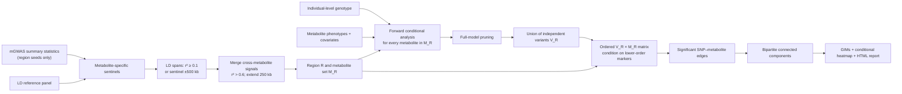

# GIMForge

**GIMForge** (Genetically Influenced Module Forge) defines regional,
genetically co-regulated SNP–metabolite modules following Surendran et al.,
*Nature Medicine* (2022), DOI
[10.1038/s41591-022-02046-0](https://doi.org/10.1038/s41591-022-02046-0).
The name is intentionally omics-neutral so the same module-building framework
can later support other quantitative molecular phenotypes.

GIMForge does **not** run mGWAS. Existing mGWAS summary statistics are used only
to seed candidate regions. GIMs are then defined from individual-level
genotype, prepared metabolite phenotypes, covariates, and a population-matched
LD reference panel.


## How a GIM is defined



The key statistical object is the ordered `V_R × M_R` matrix:

1. Within each region, every associated metabolite is analysed separately.
2. Forward conditional analysis repeatedly adds the strongest significant
   regional SNP while conditioning on earlier SNPs.
3. All forward-selected SNPs are fitted together; retained signals are united
   across metabolites to form `V_R`.
4. Among the remaining `V_R × M_R` tests, the strongest association selects
   the next marker. That marker is evaluated against all metabolites while
   conditioning only on markers with lower order.
5. Significant cells become SNP–metabolite edges. Each connected component of
   this regional bipartite graph is one GIM.

The HTML heatmap displays the actual conditional beta and P value in every
cell; it does not re-cluster or smooth the analysis result.

## Files to prepare

A complete run needs a region-seed input, an LD reference panel,
individual-level analysis genotypes, and two individual-level tables
containing quantitative phenotypes and covariates. The region-seed input can
be existing mGWAS results or previously clumped sentinels. GIMForge does not
run the upstream mGWAS.

| Argument | File supplied by the user | Used for |
| --- | --- | --- |
| `--sumstats`, `--sumstats-manifest`, **or** `--sentinels` | One stacked table, a manifest pointing to one GWAS result per trait, or reviewed output from `gimforge clump` | Selecting trait-specific sentinels, or reusing already selected sentinels. |
| `--ld-bfile` | PLINK 1 BED/BIM/FAM prefix | Sentinel clumping, LD spans, and cross-metabolite region merging. |
| `--bfile` | PLINK 1 BED/BIM/FAM prefix | Individual-level conditional association models. |
| `--phenotypes` | Uncompressed, headered, tab-separated text | Quantitative molecular traits analysed in each region. |
| `--covariates` | Uncompressed, headered, tab-separated text | Covariates included in every individual-level conditional model. |

For summary statistics, a filename ending in `.csv` or `.csv.gz` is parsed as
comma-separated. Every other summary-statistic filename, including `.tsv`,
`.tsv.gz`, and `.txt`, is parsed as **tab-separated**.

Phenotype and covariate files are passed to PLINK2 and must therefore be
uncompressed, headered, tab-separated text. GIMForge intentionally does not
make a second temporary copy of these potentially large tables. CSV and gzip
phenotype/covariate inputs are rejected before analysis. This is a stricter
subset of the official [PLINK2 phenotype and covariate
format](https://www.cog-genomics.org/plink/2.0/input#pheno). UTF-8 text without
thousands separators is recommended.

### 1. mGWAS summary statistics

For raw mGWAS results, GIMForge accepts two equivalent layouts. Supply either
`--sumstats` or `--sumstats-manifest`. A full run may instead resume from
`--sentinels`, as described below.

#### Option A: one stacked table with `--sumstats`

This is the long-format table in which results from multiple metabolite GWAS
have been concatenated row-wise. The `metabolite` field identifies which GWAS
each association belongs to. The file may contain the complete mGWAS results,
not only significant rows. GIMForge reads it once, keeps autosomal
associations passing `--sentinel-p`, and does not rerun GWAS.

Required logical fields:

| Logical field | Default column | Accepted automatic aliases | Required content |
| --- | --- | --- | --- |
| Trait | `metabolite` | `Metabolite`, `trait`, `phenotype` | A stable quantitative-trait ID. It must exactly equal a column name in the phenotype file. |
| Chromosome | `chromosome` | `CHROM`, `#CHROM`, `chr` | Autosomes `1`–`22`; lowercase `chr1`–`chr22` are also accepted. |
| Position | `position` | `POS`, `BP`, `pos` | Integer base-pair position in the same genome build as both genotype datasets. |
| Variant ID | `snp_id` | `ID`, `SNP`, `rsid`, `MarkerName` | Unique ID that exactly matches the corresponding BIM variant ID. |
| P value | `p` | `P`, `p_value`, `Pvalue` | Numeric value in `(0, 1]`; scientific notation is accepted. |

Minimal tab-separated example:

```text
metabolite	chromosome	position	snp_id	p
M001	1	154453788	rs11209026	2.1e-14
M002	1	154453788	rs11209026	8.4e-13
M001	6	32658541	rs9273363	4.7e-12
```

Extra columns such as effect allele, beta, standard error, allele frequency,
or sample size are allowed and ignored in region construction. Summary
statistics are used only for trait, coordinate, variant ID, and P value, so
effect-allele harmonisation is not performed at this stage.

#### Option B: one file per GWAS with `--sumstats-manifest`

No manual concatenation is required. Prepare a small manifest with exactly two
columns, `trait_id` and `path`:

```text
trait_id	path
M001	sumstats/M001.tsv.gz
M002	sumstats/M002.tsv.gz
M003	sumstats/M003.tsv.gz
```

Paths may be absolute or relative to the manifest file. Each referenced GWAS
file contains results for exactly one quantitative trait and therefore does
**not** need a `metabolite` column:

```text
#CHROM	POS	ID	P
1	154453788	rs11209026	2.1e-14
6	32658541	rs9273363	4.7e-12
```

The remaining required fields are chromosome, position, variant ID, and P
value, with the same accepted aliases listed above. All files in one manifest
must use the same column scheme. Each `trait_id` must be unique and must
exactly equal a phenotype column name.

GIMForge streams through the files one by one and retains only rows passing
`--sentinel-p`; it does not create a combined summary-statistic file or keep a
large temporary copy.

Choose whichever layout already exists on disk. GIMForge does not expand a
long-format file into per-trait files, and it does not concatenate manifest
inputs into another large file. In either mode, only threshold-passing
candidates are retained for clumping; each small trait-specific PLINK input is
deleted as soon as that trait finishes.

#### Option C: resume from `gimforge clump` output with `--sentinels`

`gimforge clump` writes a standard five-column long table:

```text
metabolite	chromosome	position	snp_id	p
M001	1	154453788	rs11209026	2.1e-14
M002	1	154453788	rs11209026	8.4e-13
M003	6	32658541	rs9273363	4.7e-12
```

This is **not** a concatenation of complete GWAS results. It contains only the
lead variants retained after each trait was clumped independently. A full run
can consume the reviewed table with
`--sentinels results/clumping/sentinels.tsv`; it then skips sentinel filtering
and clumping, but still uses `--ld-bfile` to define LD spans and merge
cross-trait regions. Every supplied sentinel row is preserved, so the
clumping command and its `run_manifest.json` should be retained together for
provenance.

Nonstandard column names can be declared explicitly:

```bash
--sumstats-metabolite-column trait_id \
--sumstats-chromosome-column CHR \
--sumstats-position-column BP \
--sumstats-snp-column RSID \
--sumstats-p-column PVALUE
```

### 2. LD reference panel: `--ld-bfile`

Supply a PLINK 1 binary prefix, **without** `.bed`, `.bim`, or `.fam`. For
example, this command:

```bash
--ancestry EAS \
--ld-bfile reference/1000G_EAS \
--ld-panel-name "1000 Genomes Phase 3 EAS"
```

requires all three files:

```text
reference/1000G_EAS.bed
reference/1000G_EAS.bim
reference/1000G_EAS.fam
```

The reference panel requirements are:

- the selected ancestry is supplied with `--ancestry
  AFR|AMR|EAS|EUR|SAS|CUSTOM`;
- its genome build is identical to the mGWAS coordinates and analysis
  genotype;
- BIM variant IDs match the summary-statistic `snp_id` values exactly;
- variants are autosomal, biallelic A/C/G/T SNPs with unique IDs;
- the panel has adequate variant density around mGWAS sentinel candidates.

The six standard BIM columns are chromosome, variant ID, centimorgan
position, base-pair position, allele 1, and allele 2. A typical line is:

```text
1	rs11209026	0	154453788	A	G
```

Reference-panel sample IDs do not need to overlap the study cohort. GIMForge
does not bundle or automatically download panels, and it never silently uses
`--bfile` as a replacement. The ancestry, panel label, and resolved local path
are written to `run_manifest.json` and `report.html`.

### 3. Analysis genotype: `--bfile`

This is a second PLINK BED/BIM/FAM prefix containing the individuals used in
the conditional models:

```text
data/cohort_genotypes.bed
data/cohort_genotypes.bim
data/cohort_genotypes.fam
```

Invoke it as `--bfile data/cohort_genotypes`. It must use the same genome build
and compatible variant IDs as the mGWAS and LD panel. Its FAM `FID` and `IID`
values must match the phenotype and covariate tables exactly. Unmatched
individuals are not analysed.

A standard six-column FAM line is:

```text
F001	S001	0	0	1	-9
```

The phenotype stored in the sixth FAM column is ignored; molecular phenotypes
come from `--phenotypes`. Version 0.1 accepts hard-call BED input. It filters
to autosomal biallelic A/C/G/T SNPs and applies `--mac-min`; optional genotype
missingness filtering is controlled by `--geno-missing-max`.

### 4. Quantitative phenotype table: `--phenotypes`

The first two columns must be named exactly `FID` and `IID`. Every remaining
column is one quantitative molecular trait:

```text
FID	IID	M001	M002	M003
F001	S001	0.381	-0.227	1.104
F001	S002	-0.514	0.093	0.672
F002	S003	1.238	-0.841	-0.126
```

Requirements:

- one row per individual and no duplicated `FID`/`IID` pair;
- trait columns contain numeric analysis-ready values;
- every summary-statistic trait ID has an exactly matching phenotype column;
- phenotype column names are unique and preferably PLINK-safe identifiers
  such as `M001`, `protein_IL6`, or `lipid_001`;
- missing phenotype values may be encoded as `NA`, `nan`, or `-9`; PLINK2
  determines the usable sample set separately for each trait.

Trait normalisation, batch correction, transformation, and other
phenotype-specific preprocessing are upstream responsibilities. Supply the
same quantitative phenotype definition used by the intended conditional
analysis; do not place display-only metabolite names in numeric cells.

### 5. Covariate table: `--covariates`

The first two columns must again be `FID` and `IID`. All remaining columns must
be numeric covariates:

```text
FID	IID	age	sex	PC1	PC2	PC3	batch_2
F001	S001	54	0	-0.012	0.004	0.018	0
F001	S002	61	1	0.007	-0.015	0.003	1
F002	S003	48	0	0.021	0.011	-0.009	0
```

Requirements:

- one row per individual and no duplicated `FID`/`IID` pair;
- at least one covariate column;
- categorical variables are encoded numerically before running GIMForge
  (for example, dummy/indicator columns);
- all covariates must be present for an individual to enter the analysis;
  rows containing an empty value, `NA`, `NaN`, or `-9` in any covariate are
  excluded;
- covariates should include the exact adjustment set intended for every
  forward, full-model, and ordered-matrix regression.

GIMForge passes covariates to PLINK2 with variance standardisation for
numerical stability. It does not automatically infer sex, ancestry principal
components, batches, clinical groups, or interaction terms.

### Cross-file consistency checklist

Before starting a full run, verify:

1. mGWAS summary statistics, LD panel, and analysis genotype use one genome
   build, for example all GRCh37 or all GRCh38.
2. Summary-statistic `snp_id` values exist with the same IDs in the LD-panel
   BIM; regional variants also exist in the analysis BIM.
3. Summary-statistic trait IDs exactly equal phenotype column names.
4. Phenotype and covariate `FID`/`IID` pairs match the analysis FAM.
5. `--ancestry` describes the actual LD panel; it is not inferred from the
   panel filename.
6. The phenotype and covariate files contain numeric analysis-ready values
   rather than labels such as `male`, `control`, or `<LOD`.

The two genotype prefixes have different roles:

| Property | `--ld-bfile` | `--bfile` |
| --- | --- | --- |
| Individuals | Population reference samples | Study participants |
| Phenotypes required | No | Supplied separately in `--phenotypes` |
| Used to define regions | Yes | No |
| Used for conditional regression | No | Yes |
| May be the same prefix | Technically possible, but must be an explicit, justified choice | — |

## Linux installation and dependency check

```bash
python3 -m pip install .
gimforge doctor
```

GIMForge requires Python 3.10+ and PLINK2. It has no third-party Python runtime
dependencies. Every `gimforge run` checks PLINK2 before starting. If PLINK2 is
missing, GIMForge prints an installation link and explains how to supply
`--plink2 /absolute/path/to/plink2`.

```bash
gimforge doctor --plink2 /opt/plink2/plink2
```

All commands print timestamped stage progress by default. `run`, `clump`, and
`components` mirror the same messages to `OUT/run.log`; report regeneration
appends to `RESULTS/run.log`. `--verbose` additionally exposes PLINK2 output
for diagnosing a failed statistical step.

## Run clumping only

When given raw summary statistics, the full `gimforge run` workflow performs
trait-specific LD clumping before it defines regions. The same step is exposed
independently so selected sentinels can be reviewed before conditional
analysis:

```bash
gimforge clump \
  --sumstats-manifest data/mgwas_files.tsv \
  --ancestry EAS \
  --ld-bfile reference/1000G_EAS \
  --ld-panel-name "1000 Genomes Phase 3 EAS" \
  --sentinel-p 1.25e-11 \
  --sentinel-clump-r2 0.1 \
  --sentinel-clump-window-kb 1000000 \
  --mac-min 10 \
  --threads 8 \
  --plink2 /opt/plink2/plink2 \
  --out results/clumping
```

The exact order is:

1. Read one GWAS at a time and retain autosomal rows with
   `P <= --sentinel-p`.
2. Run PLINK2 clumping **separately for each trait**, using the explicit LD
   panel, `--sentinel-clump-r2`, and `--sentinel-clump-window-kb`.
3. Stack only the retained clump leaders and attach their trait IDs, producing
   the long-format `sentinels.tsv`.
4. During `gimforge run`, calculate each sentinel's LD span and only then merge
   signals across traits using `--cross-metabolite-merge-r2`, overlap, and
   region padding.

Do not concatenate complete GWAS files and perform one global clump. A global
clump would let a strong association for one trait remove a valid sentinel for
another trait. Supplying a stacked raw `--sumstats` table is safe because
GIMForge splits it by the `metabolite` field before calling PLINK2. This
command does not run association testing.

Outputs:

| File | Contents |
| --- | --- |
| `sentinels.tsv` | One row per retained trait-specific clump leader: trait, chromosome, position, SNP ID, and P value. |
| `run_manifest.json` | Summary-statistic path, ancestry, reference-panel path/release, PLINK2 version, clumping parameters, and sentinel count. |

After review, continue without reclumping:

```bash
gimforge run \
  --sentinels results/clumping/sentinels.tsv \
  --ancestry EAS \
  --ld-bfile reference/1000G_EAS \
  --ld-panel-name "1000 Genomes Phase 3 EAS" \
  --bfile data/cohort_genotypes \
  --phenotypes data/metabolite_phenotypes.tsv \
  --covariates data/covariates.tsv \
  --plink2 /opt/plink2/plink2 \
  --threads 8 \
  --out results/gimforge
```

## Quick run

From the installed environment:

```bash
gimforge run \
  --sumstats-manifest data/mgwas_files.tsv \
  --ancestry EAS \
  --ld-bfile reference/1000G_EAS \
  --ld-panel-name "1000 Genomes Phase 3 EAS" \
  --bfile data/cohort_genotypes \
  --phenotypes data/metabolite_phenotypes.tsv \
  --covariates data/covariates.tsv \
  --plink2 /opt/plink2/plink2 \
  --threads 8 \
  --out results/gimforge
```

Every region-definition control is available on the command line. For
example:

```bash
gimforge run \
  --sumstats-manifest data/mgwas_files.tsv \
  --ancestry EAS \
  --ld-bfile reference/1000G_EAS \
  --bfile data/cohort_genotypes \
  --phenotypes data/metabolite_phenotypes.tsv \
  --covariates data/covariates.tsv \
  --sentinel-p 1.25e-11 \
  --sentinel-clump-r2 0.1 \
  --sentinel-clump-window-kb 1000000 \
  --ld-span-r2 0.1 \
  --ld-window-kb 1000000 \
  --cross-metabolite-merge-r2 0.6 \
  --no-ld-half-width-kb 500 \
  --region-padding-kb 250 \
  --out results/gimforge
```

Open the generated report on Linux:

```bash
xdg-open results/gimforge/report.html
```

For a quick report from an already-computed ordered conditional matrix:

```bash
gimforge components \
  --matrix-out matrix_out.tsv.gz \
  --conditional-p 1.24741348813236e-8 \
  --ancestry EAS \
  --reference-panel "1000 Genomes Phase 3 EAS" \
  --out results/gimforge-components
```

## Default analysis parameters

| CLI parameter | Default | Role |
| --- | ---: | --- |
| `--sentinel-p` | `1.25e-11` | Selects mGWAS associations eligible to become metabolite-specific sentinels. |
| `--sentinel-clump-r2` | `0.1` | Same-metabolite sentinel clumping threshold. |
| `--sentinel-clump-window-kb` | `1000000` | Physical window for same-metabolite sentinel clumping. |
| `--ld-span-r2` | `0.1` | Minimum LD used to construct each sentinel's coordinate span. |
| `--ld-window-kb` | `1000000` | Maximum LD search window around a sentinel. |
| `--cross-metabolite-merge-r2` | `0.6` | Merges sentinel-defined signals across metabolites. |
| `--no-ld-half-width-kb` | `500` | Fallback half-width when a sentinel has no LD neighbour. |
| `--region-padding-kb` | `250` | Extends merged regions before the final overlap merge. |
| `--conditional-p` | `1.24741348813236e-8` | Forward selection, full-model retention, matrix edges, and GIM membership. |
| `--mac-min` | `10` | Minimum allele count in conditional analysis. |
| `--metabolite-batch-size` | `1` | Bounds peak temporary-report size without changing fitted models. |

Every override is recorded in `run_manifest.json`. Temporary PLINK reports,
condition lists, and extract lists are held in a private temporary directory,
read immediately, and deleted. The genotype files are never copied.

## Conditional model and GCTA

GCTA is not required. The method conditions on individual-level genotypes:
regional additive linear models are fitted with the supplied covariates,
selected SNPs are entered as conditioning variables, and all forward-selected
signals are tested together before constructing the ordered matrix. GIMForge uses
PLINK2 for these individual-level regressions and small in-memory linear-model
calculations where needed; it does not substitute summary-statistic COJO for
the conditional procedure.

## Why singleton GIMs can dominate

A GIM is a connected component, so a significant SNP–metabolite edge with no
other retained connection is legitimately a `1 SNP × 1 metabolite` component.
An excess of such components usually reflects upstream locus construction,
not a component-building failure. Common causes are a relaxed sentinel P
threshold, an ancestry-mismatched LD panel, or windows/LD thresholds that
split signals into too many regions. The report opens the GIM with the most
metabolites first, while the complete component distribution remains in
`gim_summary.tsv`.

## Outputs

| File | Contents |
| --- | --- |
| `regions.tsv` | Final candidate regions and boundaries. |
| `region_metabolites.tsv` | Region, metabolite, and sentinel membership. |
| `forward_trace.tsv.gz` | Ordered metabolite-specific forward signals. |
| `independent_signals.tsv.gz` | Signals retained after full-model pruning. |
| `matrix_markers.tsv.gz` | Marker order and triggering association. |
| `matrix_out.tsv.gz` | Complete ordered conditional `V_R × M_R` matrix. |
| `edges.tsv.gz` / `members.tsv.gz` | Significant GIM edges and component members. |
| `gim_summary.tsv` | Compact GIM catalogue. |
| `run_manifest.json` | Inputs, LD reference panel, software versions, and parameters. |
| `report.html` | Offline interactive GIM browser. Heatmap colour is conditional β, dark borders are retained edges, and cells show −log10(P). |
| `run.log` | Timestamped progress, completion, and error messages. |

## Current backend

Version 0.1 accepts PLINK BED/BIM/FAM input and uses PLINK2 for LD and
individual-level additive conditional regression. Hard-call BED input does not
contain imputation INFO; this limitation is explicitly recorded in the
manifest. Expected-dosage BGEN support can be added without changing the GIM
definition.
