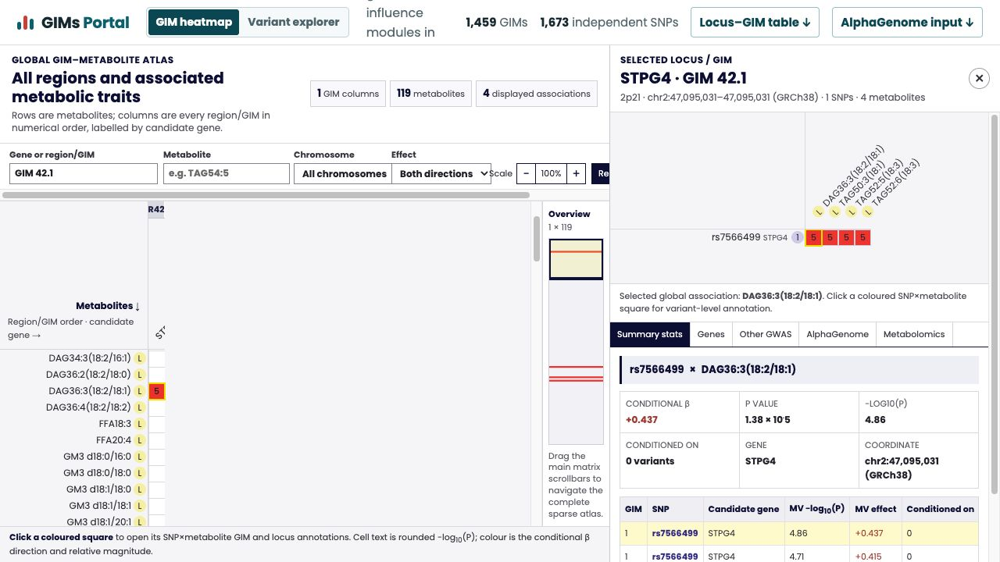

# GIMs Portal

Interactive browser and portable build pipeline for standard
[GIMForge](https://github.com/zl2860/GIMForge) results.

## One-command or portable workflows

All commands live in this `gims-portal` package. On a workstation with network
access, a standard GIMForge result can be converted, annotated, and built with
one command:

```bash
npm ci
npm run portal -- \
  --results /path/to/results/gimforge
npm run preview
```

The command prompts for the AlphaGenome API key only when unfinished
predictions remain. For a prepared bundle, annotation and page generation are
the two independent commands:

```bash
npm run portal:annotate -- --bundle /path/to/gims-portal-bundle
npm run portal:build -- --bundle /path/to/gims-portal-bundle
```

The underlying stages are:

| Command | Network | Purpose |
| --- | --- | --- |
| `npm run portal:prepare` | not required | Validate native GIMForge tables and export a portable bundle containing the result summaries and GIM-only variant catalogue |
| `npm run portal:annotate` | required | Resolve Ensembl/GRCh38 annotations, securely prompt for the AlphaGenome API key when unfinished predictions remain, and resume scalar/profile annotation |
| `npm run portal:build` | not required | Generate portal JSON/CSV, publish bundled optional evidence, and run the Vite production build |
| `npm run portal` | required | Run prepare, annotate, and build in sequence on one connected machine |

## Native GIMForge input contract

For results produced by the current GIMForge repository, `--results` is the
only scientific input required by the portal. `gimforge run` writes the
following files used by `portal:prepare`:

| GIMForge result | Portal use |
| --- | --- |
| `matrix_out.tsv.gz` | Complete conditional SNP × metabolite matrix |
| `edges.tsv.gz` | Retained significant SNP–metabolite cells |
| `members.tsv.gz` | SNP and metabolite membership of each GIM |
| `gim_summary.tsv` | GIM catalogue and ordering |
| `variants.tsv.gz` | Coordinates and the two study-observed alleles for GIM/independent-signal SNPs |
| `regions.tsv`, `region_metabolites.tsv`, `independent_signals.tsv.gz`, `region_summary.tsv`, `run_manifest.json` | Region layout, provenance, and additional annotations |

`variants.tsv.gz` is a small annotation catalogue, not a genotype matrix. It
contains no participant IDs, dosages, phenotypes, or covariates. Consequently,
after GIMForge finishes, the portal does **not** need the original BED, FAM,
phenotype, covariate, mGWAS, or LD-reference files.

Older GIMForge result directories may not contain `variants.tsv.gz`. They
remain supported, but `portal:prepare` then needs the original study BIM once:

```bash
npm run portal:prepare -- \
  --results /path/to/older/gimforge-results \
  --bim /path/to/study-genotype.bim
```

This fallback only extracts the GIM SNP rows into the portable bundle. It never
copies participant-level genotype data.

The API key is read with a hidden terminal prompt. It is passed only to the
AlphaGenome child process, is never placed in command arguments, and is not
written to the config, bundle, logs, or web assets. If
`ALPHAGENOME_API_KEY` is already set in the process environment, the prompt is
skipped. If all requested SNPs are already complete, no credential is
requested.

## Annotation dependencies

`portal:annotate` uses an isolated Python environment so the AlphaGenome SDK
does not alter GIMForge or the portal's system Python packages. Create it once
on the internet-connected annotation machine:

```bash
cd gims-portal
python3.12 -m venv .venv-alphagenome
.venv-alphagenome/bin/python -m pip install \
  "git+https://github.com/google-deepmind/alphagenome.git" \
  pandas numpy
```

The required annotation packages are the official `alphagenome` SDK plus
`pandas` and `numpy`; the SDK installs its remaining transitive dependencies.
The Python executable can be configured with `alpha_python` in
`portal.config.json` or passed with `--alpha-python`.

Before requesting an API key, `portal:annotate` imports the SDK and its scoring
modules and reports the detected AlphaGenome, pandas, and numpy versions. If
the environment is missing or broken, the command stops before the credential
prompt and prints the exact installation command. This preflight does not make
an API request.

## Offline server → connected workstation

On the server that produced the GIMForge results:

```bash
cd gims-portal
npm ci
npm run portal:prepare -- \
  --results /path/to/results/gimforge \
  --bundle /path/to/transfer/gims-portal-bundle
```

Copy `gims-portal-bundle` to a workstation that can reach Ensembl and
AlphaGenome. The bundle contains GIMForge summary tables and a GIM-SNP-only
coordinate table; it does **not** contain individual genotypes, phenotypes, or
covariates.

On the connected workstation, using the same `gims-portal` code:

```bash
npm run portal:annotate -- --bundle /path/to/gims-portal-bundle
npm run portal:build -- --bundle /path/to/gims-portal-bundle
npm run preview
```

The finished bundle can instead be copied back to the server and passed to
`portal:build` there. Building is fully offline once annotation is finished.
Both AlphaGenome jobs checkpoint after small batches and resume by SNP ID.
Neither `portal:annotate` nor `portal:build` reads the original GIMForge
directory: both depend only on the prepared bundle.

Use `--skip-signals` when scalar AlphaGenome scores are sufficient, or
`--skip-alphagenome` to create an Ensembl-only portal. A partial portal remains
usable and labels missing predictions as pending. Add `--require-complete` to
the build command when an incomplete annotation bundle should be treated as an
error.

## Build and open the website

Once a bundle has been annotated, rebuilding the static website is fully
offline:

```bash
cd gims-portal
npm run portal:build -- --bundle /path/to/gims-portal-bundle
npm run preview
```

The production site is written to `dist/`. Vite prints the local address,
normally `http://localhost:4173/`. For source-level development with live
reload, use:

```bash
npm run dev
```

The source genotype build is retained in the bundle. Each rsID is independently
resolved to a GRCh38 coordinate for annotation, UCSC links, and AlphaGenome.

## Interface example

The global matrix is the first view. Clicking a coloured heatmap cell opens the
complete locus panel on the right: the local SNP × metabolite GIM, selected
effect, summary table, genes, PheWAS, AlphaGenome, and metabolomics tabs remain
available in the same interface.

[](docs/gims-portal-heatmap-cell-detail.png)

## Included evidence

- Conditional-model SNP–metabolite associations, regional GIM grouping, and effect estimates.
- A single global sparse heatmap for the complete run. Rows are metabolites and
  columns are every region/GIM ordered by numeric region ID and then GIM ID.
  Candidate gene symbols accompany the column labels. Select an association
  square to open the corresponding local SNP (rows) × metabolite (columns) GIM
  heatmap and its full annotation panel.
- Cytoband is a locus annotation, not a global heatmap axis or ordering field.
- dbSNP / Ensembl variation class, minor-allele frequency, most-severe consequence,
  transcript consequences, and GRCh38 mappings.
- Per-SNP UCSC Genome Browser links, centred on the GRCh38 locus. Turn on cCRE,
  ENCODE TF ChIP-seq and JASPAR motif tracks in UCSC when inspecting a locus.
- `public/data/alphagenome_input.tsv`: GRCh38, allele-normalized, one-row-per-SNP
  input manifest for an AlphaGenome REF-versus-ALT scoring workflow.
- `public/data/metabolite_cancer_annotations.json`: differential-metabolomics
  results for each GIM metabolite across the four gastric-cancer comparisons.
- `public/data/gim_locus_metabolites_summary.csv`: one row per locus, with the
  GIM IDs plus their variant, gene symbol / Ensembl gene / transcript, and
  metabolite relationships. The portal's
  **Locus–GIM table** button downloads this file. A normalized
  locus–GIM–variant version is also available as
  `public/data/gim_locus_variant_metabolites.csv`.
- A **Variant explorer** that indexes every GIM SNP by rsID, gene symbol,
  Ensembl gene, transcript, consequence, and chromosome. Its detail view joins
  GIM membership, metabolites, genomic / regulatory annotations, the gastric
  AlphaGenome prediction view, and on-demand PheWAS results from UKB-TOPMed and
  FinnGen R12. PheWAS results are fetched for the selected GRCh38 variant in
  the browser and remain linked to their primary cohort pages; they are not
  stored as a static, potentially stale portal dataset.
- The Variant explorer provides an explainable AlphaGenome multimodal
  prioritisation panel. It filters by stomach tissue, gastric cancer, immune
  cells, or all retained target entities; requires a selected output modality
  and minimum modality breadth; and sorts by multimodal breadth, absolute model
  quantile, official merged splicing, strongest GIM P value, or metabolite
  breadth. It never combines incomparable raw output scores into an opaque
  pathogenicity score. Coding/splice, multi-GIM, and multi-metabolite filters
  remain available.
- PheWAS evidence is shown as a β-versus−log10(P) scatter plot of all nominally
  significant source associations (P < 0.05, uncorrected), with hover access to
  phenotype, β, P, category, and available sample-size information. Selecting a
  GIM returns directly to the global heatmap and opens the matching locus panel.
- Single-cell result entry points are intentionally not included in this
  version of the portal.

## AlphaGenome predictions

The AlphaGenome research-preview API requires an authorized API credential and
cannot be called anonymously. The scoring job uses the official recommended
variant scorers with a pinned `ALL_FOLDS` model and the recommended 1 MB
(1,048,576 bp) sequence context. It scores only the ALT allele actually present
in the GIMForge study-allele catalogue (or the legacy BIM fallback), including
reverse-complement resolution when required, and
retains only stomach tissue, gastric-cancer, immune-cell, and shared splice-site
outputs in
`<bundle>/annotations/alphagenome_scores_summary.json`. Each row retains its raw score,
signed model-provided quantile, absolute quantile used for prioritisation,
biological scope, gene/track metadata, and exact scorer definition.
The complete table is split for the static portal as
`public/data/alphagenome_scores/<rsID>.json`
with `public/data/alphagenome_index.json` for fast portal startup: the browser
loads detailed tracks only after a variant prediction is opened. The batch also
atomically updates
`public/data/alphagenome_coverage.json`, which the portal uses to show
full-batch coverage and per-SNP availability. Create the isolated environment
once, then let `portal:annotate` request the credential with hidden input:

The multi-gigabyte unsplit summary remains in the portable annotation bundle
for reproducibility and is not duplicated into `public/` or `dist/`; the
browser uses the complete per-SNP files and compact index.

The compact index additionally stores per-scope and per-modality track counts,
maximum absolute model quantiles with their original direction, strongest-track
labels, and AlphaGenome's recommended merged splicing score:
`max |splice sites| + max |splice-site usage| + max |splice junctions| / 5`.
These values drive the explainable prioritisation panel without downloading the
complete score table at portal startup.

```bash
cd gims-portal
python3.12 -m venv .venv-alphagenome
.venv-alphagenome/bin/python -m pip install "git+https://github.com/google-deepmind/alphagenome.git" pandas numpy
npm run portal:annotate -- --bundle /path/to/gims-portal-bundle
```

Use `--max-variants 1` for a short connectivity smoke test. The command resumes
after each SNP by default and skips an individual API failure rather than
discarding the completed batch. Re-run the same command to continue an
interrupted annotation. It publishes these predictions:

- RNA expression / TSS activity
- ATAC or DNase accessibility
- ChIP-TF binding and histone-mark effects
- splicing and local contact-map changes

The portal opens predictions on the stomach-tissue view and provides an
explicit switch to stomach tissue, gastric cancer, immune cells, and all
retained target entities. Unrelated tissues and cell lines are not published.
It displays the raw AlphaGenome score
and its scorer-specific equation for every card. In particular, local ATAC,
DNase, ChIP, CAGE, and PRO-cap scores are
`log2[(sum ALT + 1) / (sum REF + 1)]`; RNA-seq scores are exon-mask log
fold-changes; splice and contact-map scores are unsigned disruption magnitudes.
The scorer/track quantile is displayed with its sign and variant ranking uses
its absolute value, so equally extreme increases and decreases are treated
symmetrically. None of these values is a measured annotation, clinical effect
size, or association P value.

The prediction dialog also loads true central 16 kb REF-versus-ALT
visualisation profiles, mean-pooled into 128 bp bins, for the explicit
AlphaGenome entities `UBERON:0000945` (stomach tissue), `CL:0000084` (primary T
cell), and `CL:0000236` (primary B cell). These compact line plots are separate
from the official 1 MB scalar prioritisation scores: they are generated with
`predict_variant`, not inferred from scalar scores. They are built and resumed
by the same `portal:annotate` command; pass `--skip-signals` to omit them.

This yields `public/data/alphagenome_signals/<rsID>.json` plus
`public/data/alphagenome_signal_coverage.json`. These are regulatory and gene-
expression predictions, not TCR/BCR receptor sequence or clonotype predictions.
They can therefore be joined to future T/BCR work through variant, candidate
gene, cell state, and clonotype metadata, rather than treated as a direct
repertoire model.
